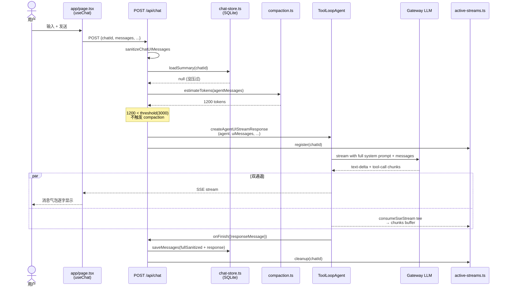
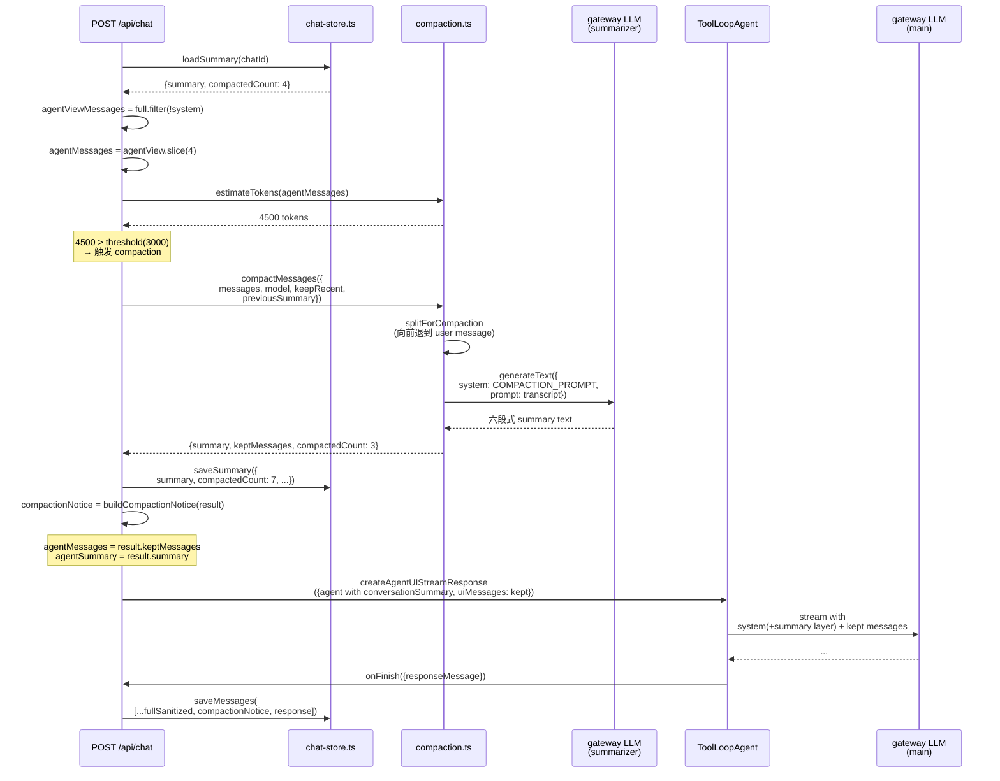
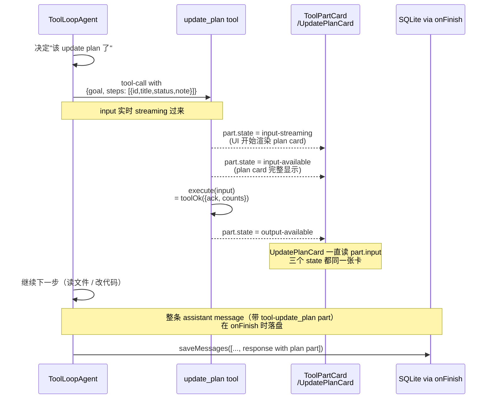
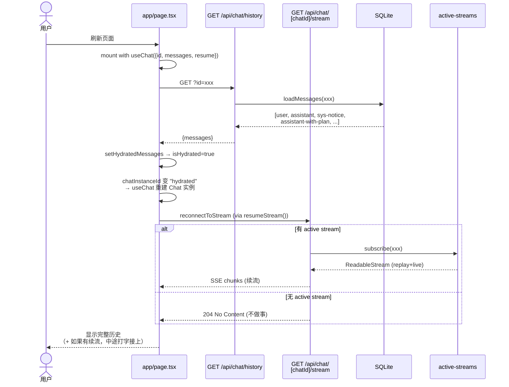

# 2026-04-22 学习笔记：长对话管理 & 活的 Plan

> 今天做了两件事，都围绕**"agent 的一次对话会不会越跑越乱、越跑越糊"** 这个问题：
>
> 1. **Context compaction（P4-b）**：对话太长会把 LLM 的上下文窗口撑爆。做法是**把老消息用 LLM 压成一段摘要**，只让 agent 看 "摘要 + 最近几条"。
> 2. **`update_plan` 工具**：多步任务跑起来用户看不到进度。做法是给 agent 一个能**反复调用**的工具，每次调用 = 一次完整的 plan 快照，UI 把它渲染成一张能看的卡片。
>
> 这份文档按"为什么要做 → 设计思路 → 代码走读 → 踩过的坑"写，从没做过 coding agent 的视角也能跟着走。

## 目录

- [Part 0：先理清前提](#part-0先理清前提)
- [Part 1：Context Compaction（长对话不爆）](#part-1context-compaction长对话不爆)
  - [1.1 问题是什么](#11-先搞清楚问题是什么)
  - [1.2 解法：handoff summary](#12-解法handoff-summary)
  - [1.3 代码走读](#13-代码走读)
  - [1.4 UI 层：压缩通知](#14-ui-层压缩通知)
  - [1.5 踩过的两个坑](#15-踩过的两个坑)
  - [1.6 为什么"DB 存全量，agent 看子集"](#16-为什么db-存全量agent-看子集)
- [Part 2：`update_plan` 工具](#part-2update_plan-工具)
  - [2.1 场景](#21-场景agent-干了好久我看不懂)
  - [2.2 解法：live plan state](#22-解法live-plan-state)
  - [2.3 和 Plan mode 的区别](#23-和-plan-modep2-b的区别)
  - [2.4 设计核心：state in tool-call input](#24-设计核心state-lives-in-tool-call-input)
  - [2.5 代码走读](#25-代码走读)
  - [2.6 对比 interactive tools](#26-对比update_plan-和-interactive-tools-的不同)
- [Part 3：贯穿一次端到端](#part-3贯穿一次端到端)
- [Part 4：设计决策小结](#part-4设计决策小结)
- [Part 5：如果你想扩展](#part-5如果你想扩展)
- [Part 6：练习题（验证你真懂了）](#part-6练习题验证你真懂了)
- [Part 7：数据流时序图](#part-7数据流时序图)
- [Part 8：术语表](#part-8术语表)
- [Part 9：和 codex / open-agents 的对比](#part-9和-codex--open-agents-的对比)
- [关键文件清单](#关键文件清单)
- [今日收尾](#今日收尾)

---

## Part 0：先理清前提

如果你跳过之前的 roadmap 跳到这一天，下面三个背景你得知道：

1. **这个项目是个本地 coding agent**，基于 Vercel AI SDK v6。主聊天路由 `/api/chat` 用 `ToolLoopAgent` 跑，agent 能调工具（读文件、写文件、查代码……）。
2. **P3-b 做过消息持久化**：每条 UIMessage 都落盘到 `.data/chat.db` 的 SQLite；前端刷新还能看到历史。
3. **P3-c 做过交互工具抽象**：`ask_question` / `ask_choice` / `show_reference` 这种"问用户"的工具；还封装了 `approvedTool` / `interactiveTool` 两个 factory helper。

今天的两个新 feature 都**建立在这些已有能力之上**（尤其 P3-b 的 DB）。

---

## Part 1：Context Compaction（长对话不爆）

### 1.1 先搞清楚问题是什么

大语言模型都有一个 **context window**（上下文窗口）——一次请求能看到的 token 总量上限。Gemini 1M / Claude 200k / GPT-4o 128k。

问题：一次对话会**单调增长**。每发一轮消息：
- 你发的新消息
- Agent 的文字回复
- Agent 调了几个工具（每个 `read_file` 可能返回几千 token 的文件内容）
- 工具结果

这些**都要进下一轮请求的上下文**，因为模型不记忆历史，每次请求都要把**完整历史**重新发过去。聊 20 轮以后，一次请求可能就是几十万 token——慢、费钱、最后会超窗口爆掉。

### 1.2 解法：handoff summary

想象你和 agent 聊了 50 轮。现在 token 顶到天花板了。Compaction 的思路：

```
[原始：50 轮完整对话，200k tokens]
  ↓ 触发压缩 ↓
[压缩后：一段 500 字摘要 + 最近 8 轮完整对话]
= 1.5k tokens + 30k tokens ≈ 31k tokens
```

摘要是怎么产生的？**再调一次 LLM**，让它看前 42 轮对话，写一段结构化的"剧情概述"。这段摘要进 system prompt，最近 8 轮作为正常的 message history。

三件事要做：

| 组件 | 职责 | 代码 |
|---|---|---|
| **Token 估算** | 判断什么时候该压 | `estimateTokens(messages)` |
| **摘要器** | 真的调 LLM 把老消息压成摘要 | `compactMessages(...)` |
| **触发器** | 每次 POST 前检查阈值 | POST handler 开头 |

### 1.3 代码走读

#### 1.3.1 [lib/compaction.ts](../lib/compaction.ts) —— 核心

```ts
// 粗估 tokens：char count / 3
// 中文 ~1 char/token，英文 ~4 char/token，JSON 介于两者
// 3 是中间值，足够判断"要不要压缩"的阈值
export function estimateTokens(messages: UIMessage[]): number {
  let totalChars = 0;
  for (const message of messages) {
    totalChars += messageToFullPlainText(message).length;
  }
  return Math.ceil(totalChars / 3);
}
```

为什么不用 `tiktoken` 之类精确 tokenizer？阈值判断粗估够用；多引一个依赖、多写 provider-specific 分词代码都不值得。

```ts
export async function compactMessages(params: {
  messages: UIMessage[];
  model: LanguageModel;
  keepRecent: number;
  previousSummary?: string | null;
}): Promise<CompactionResult> {
  const { messages, model, keepRecent, previousSummary } = params;
  const { toCompact, kept } = splitForCompaction(messages, keepRecent);

  if (toCompact.length === 0) {
    // 没啥好压的（对话还太短）
    return { summary: "", keptMessages: kept, compactedCount: 0, ... };
  }

  // 拼 summarizer 的 prompt：上次摘要（如果有）+ 要压缩的老对话
  const transcriptParts: string[] = [];
  if (previousSummary) {
    transcriptParts.push(`(Previous handoff summary: ${previousSummary})`);
  }
  transcriptParts.push("--- Conversation transcript to compact ---");
  for (const message of toCompact) {
    transcriptParts.push(messageToSummarizerInput(message));
  }

  // 调用 LLM 做摘要
  const result = await generateText({
    model,
    system: COMPACTION_SYSTEM_PROMPT,  // 六段式结构
    prompt: transcriptParts.join("\n\n"),
  });

  return { summary: result.text.trim(), keptMessages: kept, ... };
}
```

**三个值得注意的细节**：

1. **`previousSummary` 参数**：如果已经压过一次，这次要再压时，要把上次摘要喂给 summarizer。**链式压缩**：每次新摘要都"站在上次摘要肩膀上"，不会每次从头压一遍。
2. **六段式结构化 prompt**：`COMPACTION_SYSTEM_PROMPT` 让 summarizer 按固定六段输出——USER'S CORE REQUEST / COMPLETED / DECISIONS / PREFERENCES / PENDING / OPEN QUESTIONS。参考 codex 的 `compact.rs`，这是 handoff 场景最稳的结构。
3. **`generateText` 而不是 `streamText`**：摘要是一次性产物，不需要流式输出。

#### 1.3.2 [lib/chat-store.ts](../lib/chat-store.ts) —— 持久化摘要

新加了一张表：

```sql
CREATE TABLE IF NOT EXISTS session_summaries (
  session_id      TEXT PRIMARY KEY,
  summary         TEXT NOT NULL,
  compacted_count INTEGER NOT NULL,  -- 这条 summary 对应原历史的前 N 条
  tokens_before   INTEGER NOT NULL,  -- 压之前多少 token
  tokens_after    INTEGER NOT NULL,  -- 压之后多少 token
  updated_at      INTEGER NOT NULL
);
```

每个 session 最多一行——**同一个 session 只有"一段当前最新的摘要"**，不累积多条。每次再压就 UPSERT 覆盖。

#### 1.3.3 [lib/prompt-layers.ts](../lib/prompt-layers.ts) —— 摘要注入 system prompt

Prompt 层多了一层：

```
# Persona
(稳定身份)

# Developer rules
(运行期规则 + CLARIFICATION GATE)

# Environment context
(cwd / shell / date)

# User project instructions
(AGENTS.md)

# Conversation summary so far    ← 新增
(The conversation has been compacted. ...)
<六段式摘要>
```

这层只在 `conversationSummary` 不为 null 时加。

**为什么是 system prompt 层，不是放进 messages？** 模型看到 system prompt 知道"这是引导上下文"，看到 messages 以为"这是真的对话历史发生过"。摘要本质是 meta-context，system prompt 放更合适。

#### 1.3.4 [app/api/chat/route.ts](../app/api/chat/route.ts) —— POST 里接线

```ts
// 1. 读上次的摘要（如果有）
const existingSummary = loadSummary(chatId);
const compactedCountSoFar = existingSummary?.compactedCount ?? 0;

// 2. 算 agent 现在实际看到的消息
//    （fullSanitized 里过滤掉 role=system 的通知消息，见 1.5）
const agentViewMessages = fullSanitized.filter(m => m.role !== "system");
let agentMessages = agentViewMessages.slice(compactedCountSoFar);
let agentSummary = existingSummary?.summary ?? null;

// 3. 估 tokens，看要不要压
const currentTokens = estimateTokens(agentMessages);
if (currentTokens > env.compaction.thresholdTokens) {
  const result = await compactMessages({
    messages: agentMessages,
    model: summarizerModel,
    keepRecent: env.compaction.keepRecentMessages,
    previousSummary: agentSummary,
  });
  if (result.compactedCount > 0) {
    saveSummary(chatId, { summary: result.summary, ... });
    agentMessages = result.keptMessages;  // agent 只看 kept
    agentSummary = result.summary;         // 作为 prompt layer 注入
  }
}

// 4. 把摘要穿过 builder 传进 buildSystemPrompt
const agent = createProjectEngineerAgent({
  tools: ...,
  conversationSummary: agentSummary,  // ← 新增字段
});
```

流程清晰：**拿现状 → 判断 → 压 → 存 → 把摘要塞进 system prompt → 跑 agent**。

### 1.4 UI 层：压缩通知

压缩发生时，UI 应不应该告诉用户？两派选择：

- **静默**（codex 0.95 版本之前）：用户完全不知道，感觉很玄
- **提示一行**（最终选择）：告诉用户"刚才折叠了 N 条消息"，用户知道这是系统行为而不是 bug

我们选了后者。做法：**在消息流里插一条 `role=system` 的 UIMessage**，UI 渲染成一条虚线居中的小徽章：

```
─ ─ ─ ─  [ ● COMPACTED · 2 MSGS · 8.8K→7.4K TOKENS ]  ─ ─ ─ ─
```

实现三个关键点：

1. **用 sentinel 前缀区分**（见 [lib/compaction.ts](../lib/compaction.ts) 的 `COMPACTION_NOTICE_SENTINEL`）：
   ```
   __compaction_notice__::{"compactedCount":2,"tokensBefore":8830,...}
   ```
   前端看到这个前缀就解析 JSON 渲染，看不到就退回纯文本。**用结构化 payload 胜过纯文本**，UI 能分字段渲染得漂亮。

2. **sanitizer 留着，但 agent 视角过滤掉**（见 `route.ts` 的 `agentViewMessages`）：
   - DB 存着 system notice（所以 UI 刷新能看到）
   - Sanitizer 不丢弃（所以 UI 能读到）
   - **但进 agent 的 message list 里必须过滤**——不然 LLM 会把这些看成真的 system 指令，污染 system prompt

3. **MessageBubble 早退**（见 [app/_components/MessageBubble.tsx](../app/_components/MessageBubble.tsx)）：
   ```tsx
   if (message.role === "system") {
     return <SystemNoticeLine message={message} />;  // 不走气泡渲染
   }
   ```

### 1.5 踩过的两个坑

这部分对理解 compaction 最有帮助——**看 bug 比看 happy path 学得多**。

#### 坑 1：estimateTokens 严重低估

```ts
// 原来的代码（有 bug）
function messageToPlainText(message: UIMessage): string {
  // ...
  const inputSummary = toolPart.input ? JSON.stringify(toolPart.input).slice(0, 500) : "";
  const outputSummary = toolPart.output ? JSON.stringify(toolPart.output).slice(0, 800) : "";
  // ...
}
```

问题：这个函数**同时**被用作"给 summarizer 的输入"和"token 估算"。截断 500/800 字符是为了给 summarizer 省成本，但用于 token 估算就**把 tool output 缩了 10-30 倍**。一个 `read_file` 返回 10000 字符，估值只看到 800，实际 LLM 看到 10000——compaction 永远触发不了。

修复：拆成**两个函数**：

```ts
function messageToSummarizerInput(message)  // 截断版（summarizer 用）
function messageToFullPlainText(message)   // 完整版（estimateTokens 用）
```

**教训**：一个函数承担了两个不同语义的职责，一旦任一语义变化就会踩坑。**"服务于两个消费者的工具函数"是气味**。

#### 坑 2：splitForCompaction 让 kept 以 assistant 起头

Agent 的工具循环长这样：
```
user: "帮我改..."
assistant: [text + tool-call read_file]
assistant: [text + tool-call list_files]
assistant: [text + tool-call search_code]
... (10 轮 tool 调用) ...
```

**很长的对话里可能只有一条 user message**。触发压缩时，我原来的 split 逻辑：

```ts
let splitIndex = messages.length - keepRecent;
// 往后找 user message
while (splitIndex < messages.length && messages[splitIndex].role !== "user") {
  splitIndex++;
}
```

这段从初始 split 点**向后找 user**，如果后面全是 assistant（上面那种情况），一路找到尽头——然后兜底退回原 split 点。kept = 8 条全是 assistant。

结果：LLM 收到 "这里有 8 条 assistant 消息但前面没有 user 发话"，**完全蒙圈**。返回 `finishReason = "other"` + 空响应。用户看到的是："agent 不说话了"。

修复：**向前找 user** 而不是向后：

```ts
while (splitIndex > 0 && messages[splitIndex].role !== "user") {
  splitIndex--;
}
// 如果前面也没 user，干脆不压缩
if (messages[splitIndex]?.role !== "user") {
  return { toCompact: [], kept: messages };
}
```

kept 可能稍微多几条（超过 keepRecent），但**永远以 user message 起头**，LLM 能理解上下文。

**教训**：LLM 对 "message list 以 assistant 起头" 的反应非常脆弱——它既不会报错，也不会正确响应，就是**空转结束**。调试时看 `finishReason` 是排查此类 bug 的第一信号。

### 1.6 为什么"DB 存全量，agent 看子集"

架构上有个分叉：

| 层 | 看什么 |
|---|---|
| **DB / UI** | 完整历史（所有消息都在，用户随时能翻） |
| **Agent / LLM** | `compactedCount` 之后的 kept + summary |

好处是**UI 不丢东西**——用户不会因为系统压缩而"忘记"自己以前说过什么。所有 "消失" 的历史实际上都在 `.data/chat.db` 里。

实现：`onFinish` 里手动拼**完整消息 + notice + responseMessage** 存进 DB：

```ts
onFinish: ({ responseMessage }) => {
  const allMessages: UIMessage[] = [...fullSanitized];
  if (compactionNotice) allMessages.push(compactionNotice);
  allMessages.push(responseMessage);
  saveMessages(chatId, allMessages);
}
```

对比：agent 跑的时候 `uiMessages = agentMessages`（被截断的 tail）；DB 存的是 `fullSanitized + 新 response`（完整）。**两条路径不同，是故意的**。

---

## Part 2：`update_plan` 工具

### 2.1 场景：agent 干了好久我看不懂

用户："帮我给项目加个测试框架，跑起来能通过"

之前的世界（没 `update_plan`）：
- Agent 读 package.json
- Agent 读 README
- Agent 装 Vitest
- Agent 写 config
- Agent 写第一个测试
- Agent 跑 npm test
- ...
- 10 分钟后，Agent 说 "做完了"

你盯着聊天流的时候：
- 哪步完成了？不知道
- 卡住了吗？不知道
- 还剩多少？不知道
- 走偏了吗？不知道

### 2.2 解法：live plan state

给 agent 一个 `update_plan` 工具。它能在执行期**反复调用**，每次调用 = 一次**完整快照**（不是 diff）：

```
Agent 调 update_plan 第 1 次:
  goal: 给项目加 Vitest
  ○ step-1  装 Vitest 依赖
  ○ step-2  配 vitest.config.ts
  ○ step-3  写第一个测试
  ○ step-4  跑 npm test 验证

... Agent 装完依赖 ...

Agent 调 update_plan 第 2 次:
  goal: 给项目加 Vitest
  ✓ step-1  装 Vitest 依赖        ← status 从 pending 变 done
  ● step-2  配 vitest.config.ts   ← 变 in_progress
  ○ step-3  ...
```

每次调用都是一张新 plan card 出现在消息流里，**progress bar 涨**、**已完成的 step 打绿勾**、**卡住的 step 变红**。

### 2.3 和 Plan mode（P2-b）的区别

这两个容易搞混。大白话：

- **Plan mode** = 动工**前**的**提案**（一次性生成、用户审阅）
- **`update_plan`** = 动工**中**的**进度看板**（反复更新、activate 里一直在跑）

Plan mode 的流程：
```
用户打开 Plan toggle → 发任务 → streamObject 生成结构化 plan → 
用户审阅/编辑/接受 → plan 转 markdown 作为 user message → 
agent 看到 markdown 开始执行 → [Plan mode 的使命结束]
```

`update_plan` 的流程：
```
Agent 任何时候都可以调 update_plan（不必走 Plan mode）→ 
调一次就多一张 plan card 进消息流 → 
执行中反复更新 → 
任务结束 → [plan 最终状态留在消息流里]
```

**可以一起用**：用户走 Plan mode 审阅一个初始 plan → agent 拿到后第一次 `update_plan` 把它转成 live plan → 执行中反复更新。现在这个联动是松的（靠 prompt 引导），没做成硬绑定。

### 2.4 设计核心：state lives in tool-call input

做 `update_plan` 之前有几个设计选项：

| 选项 | 描述 | 缺点 |
|---|---|---|
| A | 新建一张 `plans` 表，每次 update 写 DB | 多一张表；需要特殊的 GET 接口让 UI 读；消息历史和 plan 脱节 |
| B | plan 存在 session metadata 里 | localStorage 也要改；消息流不可见 |
| **C** | **plan 存在 tool-call 的 `input` 里** | **无需任何新存储** |

选 C。关键洞察：**AI SDK 的每次 tool call 都是一条 assistant message 的一个 part**，**P3-b 的 DB 本来就持久化所有 UIMessage parts**。所以——

**Agent 调 `update_plan({ goal, steps })` 时，`steps` 参数直接就是 plan 的状态**。DB 自动存下来，UI 从 `part.input` 读出来渲染。

好处：
- **零新存储**。没有新表、没有新接口、没有特殊同步。
- **多次调用 = 消息流里多张 plan card**。用户能看到 plan 的**演进历史**，不是只有最新状态。
- **天然 resume**：刷新页面，plan cards 还在消息流里（因为它们是 UIMessage）。

### 2.5 代码走读

#### 2.5.1 [lib/plan-tools.ts](../lib/plan-tools.ts) —— 工具定义

```ts
export const planStepSchema = z.object({
  id: z.string().min(1).describe("stable short id ... MUST be consistent across updates"),
  title: z.string().min(1),
  status: z.enum(["pending", "in_progress", "done", "blocked", "skipped"]),
  note: z.string().optional(),
});

export const updatePlanInputSchema = z.object({
  goal: z.string().min(1),
  steps: z.array(planStepSchema).min(1).max(12),
});

export const updatePlanTool = tool({
  description: "...",  // 大段的"何时调用 / 何时不调用"引导
  inputSchema: updatePlanInputSchema,
  // server-side execute 是个 no-op：plan state 本身就在 input 里，
  // execute 只返回 ack 让 agent loop 推进
  execute: async (input) => toolOk({
    acknowledged: true,
    stepCount: input.steps.length,
    doneCount: input.steps.filter(s => s.status === "done").length,
  }),
});
```

几个关键设计：

1. **`id` 字段稳定性**：description 里反复强调 id 跨 snapshot 必须一致。不然 UI 没法识别"这是同一步"。这是**prompt engineering** 的一部分——LLM 的纪律完全靠 description + prompt 引导，**没有 runtime 强制机制**。

2. **`steps[].min(1).max(12)`**：限制 plan 规模。太大的 plan 失去可读性；太细碎的 plan 是噪声。

3. **5 种 status**：`pending / in_progress / done / blocked / skipped`。codex 只有 3 种，我们多了 `blocked` 和 `skipped`——实际执行中 "卡住了" 和 "故意不做" 是两种常见状态，合并成 "non-pending" 信息丢失。

4. **execute 是 no-op**：它的存在只是为了让 tool loop 能前进（AI SDK 的 tool 需要 output 才能进入下一步）。真正的 state 存在 `input` 里，不存在 `output`。

#### 2.5.2 [app/_components/tool-card/UpdatePlanCard.tsx](../app/_components/tool-card/UpdatePlanCard.tsx) —— UI 渲染

关键代码：

```tsx
export function UpdatePlanCard({ part }: { part: LooseToolPart }) {
  // 读 tool-call 的 input，就是当前 plan 状态
  const input = (part.input ?? {}) as UpdatePlanInputShape;
  const goal = input.goal?.trim() ?? "";
  const steps = Array.isArray(input.steps) ? input.steps : [];
  const doneCount = steps.filter(s => s.status === "done").length;
  const progress = total > 0 ? Math.round((doneCount / total) * 100) : 0;

  return (
    <div className="corner-bracket relative text-sky-600">
      <div className="rounded-md border border-sky-400 bg-sky-50/30 p-4">
        {/* Header: 状态指示圆点 + 标题 + done/total */}
        {/* Goal: 一行展示 */}
        {/* Progress bar: 宽度 = progress% */}
        {/* Steps: ol 列表，每步一个 bullet + 标题 + status 徽章 + note */}
      </div>
    </div>
  );
}
```

**状态对应的视觉语言**：
- `pending`：灰 `○`（空圆）
- `in_progress`：sky-600 `●` 脉冲动画（显眼）
- `done`：emerald-600 `✓` + 文字删除线（clearly 完成）
- `blocked`：rose-600 `✕` + note 强调（显眼警报）
- `skipped`：slate-400 `—` 斜体（低调）

**关键决策**：不做"latest plan pinned 在顶部"——每次 `update_plan` 调用都是消息流里**独立一张卡**。这样用户能看到 plan 演进历史。

#### 2.5.3 [app/_components/tool-card/ToolPartCard.tsx](../app/_components/tool-card/ToolPartCard.tsx) —— 分发

```tsx
// 在默认 state machine 前加一个 early-return
if (toolName === "update_plan") {
  return <UpdatePlanCard part={part} />;
}
```

**为什么要 early-return，不走默认状态机？**

默认状态机会把 `output-available` 包在 `<details>` 折叠卡里（"tool · xxx · done"），再在 body 里渲染 output。但 `update_plan` 的核心 UI 是 plan card 本身，不需要折叠；plan card 无论在 input-streaming、input-available 还是 output-available 状态都是**读 `part.input` 渲染**，逻辑一致。让它走默认状态机反而丑（要被折叠，或者重复渲染 2 次）。

直接 early-return 覆盖默认行为，最干净。

### 2.6 对比：`update_plan` 和 interactive tools 的不同

P3-c 做了 `ask_question` / `ask_choice` 等**客户端执行**的工具（`tool()` 不给 `execute`，等客户端 `addToolOutput` 回灌）。`update_plan` 是**服务端执行**的工具（有 `execute`）。

为什么不一样？

| 维度 | interactive tools | update_plan |
|---|---|---|
| **谁填 output** | 人类（用户从 UI 输入） | 代码（execute 自动 ack） |
| **要不要等人** | 要，卡在 input-available 等用户 | 不要，秒过 |
| **目的** | 收集用户输入 | 展示 agent 自己的进度 |
| **合适的 factory** | `interactiveTool` | 直接用 `tool()` |

这个区分呼应了 P3-c 里讨论过的 **"output 来自哪里"** 那条判断标准：
- 代码能算 → server-side
- 人脑才能出 → client-side
- `update_plan` 的 output 是自动 ack（代码）→ server-side

---

## Part 3：贯穿一次端到端

用实际场景把今天做的两个 feature 串起来看。

### 场景：用户让 agent 加测试框架

```
[用户] "帮我给这个项目加个测试框架"

   ↓ 进入 POST /api/chat
   ↓ tokens=1200, 没到 3000 阈值，不触发 compaction
   ↓

[Agent] (CLARIFICATION GATE kicks in)
         调 ask_choice({
           question: "用哪个测试框架？",
           options: [
             { id: "vitest", label: "Vitest", ... },
             { id: "jest",   label: "Jest",   ... },
             { id: "node",   label: "Node test runner", ... },
           ],
           recommendedId: "vitest",
           recommendationReason: "...",
         })

[UI] 弹出 ask_choice 卡片，Vitest 有 "推荐" 徽章

[用户] 点击 Vitest 选项

   ↓ useChat.addToolOutput({ answer: "Vitest" })
   ↓ 自动发回 POST，tokens=1400，继续
   ↓

[Agent] 调 update_plan({
          goal: "给项目加 Vitest 测试框架",
          steps: [
            { id: "s1", title: "装 vitest 依赖", status: "in_progress" },
            { id: "s2", title: "写 vitest.config.ts", status: "pending" },
            { id: "s3", title: "写第一个测试", status: "pending" },
            { id: "s4", title: "跑 npm test 验证", status: "pending" },
          ],
        })

[UI] plan card 出现在消息流里，progress 0%，step-1 蓝色脉冲

[Agent] 调 read_file("package.json")     ← 读完回来 tokens=4500，超阈值！
   
   ↓ compaction 触发
   ↓ compactMessages 把前面几条压成 summary
   ↓ saveSummary(chatId, ...)
   ↓ [compaction] chat=xxx 4500→2200 tokens, compacted 2 messages
   ↓ 生成 compactionNotice
   ↓

[Agent] 调 write_file("package.json") 加 vitest 依赖
   → 触发 write approval 卡片
   → 用户点同意

[Agent] 调 update_plan({
          ...,
          steps: [
            { id: "s1", status: "done" },       ← 改状态
            { id: "s2", status: "in_progress" }, ← 下一步
            ...
          ],
        })

[UI] 消息流现在有：
     - 用户 "帮我给这个项目加个测试框架"
     - Agent 的 ask_choice 卡（Vitest 被选）
     - Agent 的第一张 plan card（progress 0%）
     - 虚线徽章 "─ ─ COMPACTED · 2 msgs · 4.5k→2.2k ─ ─"    ← compaction notice
     - Agent 的 approval 卡（已同意）
     - Agent 的第二张 plan card（progress 25%，s1 打绿勾，s2 蓝色脉冲）
     - ...

... agent 继续执行，每步完成都来一张新 plan card ...

[Agent] 最后一次 update_plan，所有 step 都 done, progress 100%
[Agent] text: "搞定了，你可以跑 npm test 试试"
```

整个过程用户**清楚看到**：
- CLARIFICATION GATE 问清楚了选哪个框架
- Plan 一开始是啥、现在到哪一步
- 什么时候系统触发了 compaction（虚线徽章提示）
- Approval 在哪几步需要批准

这就是今天两个 feature 合在一起的价值——**长对话不爆，且用户始终知道 agent 在做什么**。

---

## Part 4：设计决策小结

把今天踩过的坑和设计选择列成清单，方便以后回看：

### 关于 Compaction

- **阈值**：token 数（不是消息条数）—— 因为工具输出的大小差异巨大，消息条数不能反映真实 context 占用。
- **摘要 prompt**：六段式结构化输出，参考 codex。比 "summarize this conversation" 的自由文本更稳、信息密度更高。
- **链式压缩**：每次压缩都把上次的摘要喂给新一轮 summarizer，避免信息在多次压缩中稀释。
- **DB 存全量 + agent 看子集**：两个消息视角共存，UI 不丢历史。
- **role=system 的 notice**：用 sentinel 前缀标记 + 结构化 payload，前端精确识别；同时在 agent 视角过滤掉避免污染 system prompt。

### 关于 `update_plan`

- **state in tool-call input**：复用 AI SDK 的 tool message 机制，零新存储。
- **snapshot not diff**：每次发完整 plan，LLM 不需要记"我上次发过啥"，前端只渲染 input 即可，实现最简。
- **多张卡而不是 pinned**：保留 plan 演进历史，比只显示最新状态信息量更大。
- **id 稳定性靠 prompt 约束**：没有 runtime 机制强制，description 反复强调。这是 LLM-native 的设计风格——**用 prompt 而不是 type system 约束行为**。
- **早期调用 + 低频更新**：prompt 里鼓励 "multi-step task EARLY commit to plan"，但不是每做一点都更新——避免 UI 噪声。

### 通用原则

- **两个消费者的工具函数是气味**：坑 1（`messageToPlainText`）就是反例——一个函数同时服务 summarizer prompt 和 token 估算，语义漂移就出 bug。
- **LLM 对 message list 结构脆弱**：以 assistant 起头 → `finishReason=other` 空转。调试时看 `finishReason` 是第一信号。
- **prompt 工程是一等公民**：今天一半的工作量其实在写 description 和 developer rules，让 LLM 纪律地使用工具。`update_plan` 的 description 占了文件的 1/3。

---

## Part 5：如果你想扩展

几条自然的延伸线索：

1. **Plan mode 和 update_plan 硬联动**：用户 accept PlanCard 时自动合成一次 `update_plan` 调用，塞进消息流。需要动 frontend 的 PlanCard accept 流程 + 发请求时在 messages 末尾多加一条 assistant tool-call。半天左右。

2. **Compaction 手动触发**：加一个 `compact_conversation` 工具或 UI 按钮，让用户/agent 不等阈值就能手动压。很小。

3. **Compaction 效果的测试化验证**：如果以后补上 P4-a（MockLanguageModelV3）可以针对 compactMessages 写单测，验证 summary 的 6 段式结构、previousSummary 链式传递等。

4. **update_plan 到 Pinned View**：在 SessionHeader 加一个小的 "latest plan" 面板，一眼看到当前进度。这个是对现有 UI 的增量。

5. **Summary 的质量评估**：实际跑几次长对话，看 LLM 能不能把 "用户的偏好" 正确带到摘要里。如果带不过去，改 prompt 的 PREFERENCES 段措辞。

---

## 关键文件清单

今天碰过的文件，按重要性排：

| 文件 | 改动 |
|---|---|
| [lib/compaction.ts](../lib/compaction.ts) | 新建：token 估算、摘要器、split 逻辑、notice builder |
| [lib/plan-tools.ts](../lib/plan-tools.ts) | 新建：`update_plan` 工具 + schema |
| [app/_components/tool-card/UpdatePlanCard.tsx](../app/_components/tool-card/UpdatePlanCard.tsx) | 新建：plan 卡 UI |
| [app/api/chat/route.ts](../app/api/chat/route.ts) | 接入 compaction 检测 + notice 持久化 |
| [lib/chat-store.ts](../lib/chat-store.ts) | 加 `session_summaries` 表 + load/save |
| [lib/prompt-layers.ts](../lib/prompt-layers.ts) | 加 `conversationSummary` 层 |
| [lib/chat-agent/system-prompt.ts](../lib/chat-agent/system-prompt.ts) | 接受 conversationSummary 参数 |
| [lib/chat-agent/builder.ts](../lib/chat-agent/builder.ts) | ChatAgentConfig 加 conversationSummary 字段 |
| [lib/env.ts](../lib/env.ts) | 加 compaction 配置 |
| [app/api/chat/agent-config.ts](../app/api/chat/agent-config.ts) | 接入 planToolset + 加 PLAN TRACKING prompt 规则 |
| [app/_components/MessageBubble.tsx](../app/_components/MessageBubble.tsx) | 加 role=system 分支渲染 notice |
| [app/_components/tool-card/ToolPartCard.tsx](../app/_components/tool-card/ToolPartCard.tsx) | 加 `update_plan` dispatch |
| [app/_lib/chat-session.ts](../app/_lib/chat-session.ts) | `deriveSessionPreview` 过滤 system 消息 |

建议阅读顺序：从 `lib/compaction.ts` 开始（概念集中），然后 `app/api/chat/route.ts`（看它怎么被调用），再看 UI 侧 `MessageBubble` + `SystemNoticeLine`。之后跳到 `lib/plan-tools.ts` → `UpdatePlanCard` → `ToolPartCard`。

---

## Part 6：练习题（验证你真懂了）

读文字能理解概念，**动手跑一遍才是真懂**。下面每组练习都有明确的 "预期现象"，你跑完对一下就知道自己哪里没跟上。

> **练习前提**：先把 `.env.local` 里 `COMPACTION_THRESHOLD_TOKENS=3000` 配好，再重启 dev server。这样能快速触发 compaction。

### 练习组 A：Compaction

#### A1 · 观察 token 数随对话增长

**目标**：验证 `estimateTokens` 的修复生效（坑 1 的反例测试）。

**步骤**：
1. 新建一个 session
2. 终端盯着 `[compaction] chat=... tokens=...` 那一行
3. 在浏览器依次发：
   - "你好" → 记下 tokens 数（预期 < 500）
   - "读一下 app/page.tsx" → 等 agent 读完，**下一条消息时**看 tokens 数
   - 再发一条任意消息，看 tokens 数

**预期**：
- 第一次：几十到几百 tokens
- `read_file` 一个大文件后：tokens 应该**跳到几千**（因为 tool output 全量计入）
- 如果 tokens 从 ~500 → ~600（只涨 100），说明 **bug 1 又回来了**——`estimateTokens` 没把 tool output 完整算进去

#### A2 · 手动触发 compaction

**目标**：端到端验证 compaction 机制。

**步骤**：
1. 在 session 里让 agent 连续读 2-3 个大文件：
   - "读一下 app/page.tsx"
   - "读一下 lib/chat-agent/builder.ts"
   - "读一下 lib/write-tools.ts"
2. 读完后再发一条 "总结一下这三个文件"

**预期（终端）**：
```
[compaction] chat=xxx tokens=4500 threshold=3000 trigger=true
[compaction] chat=xxx 4500→2000 tokens, compacted 4 messages
```

**预期（UI）**：
- 消息流中出现虚线居中徽章：`─ ─ [ ● COMPACTED · 4 MSGS · 4.5K→2.0K TOKENS ] ─ ─`
- Agent 的回复里还能准确引用三个文件的内容（说明摘要把信息带过来了）

**诊断**：
- 没看到 `trigger=true` → tokens 还不够大，继续让 agent 读文件
- `trigger=true` 但没有 `compacted N` → compaction 失败，上一行会打 `failed for chat=xxx, continuing...`。看 gateway 状态
- `finish=other` 出现 → 说明 bug 2 回来了（split 点让 kept 以 assistant 起头）

#### A3 · 看摘要内容

**目标**：验证 summary 层被正确注入 system prompt。

**步骤**：
1. 触发 A2 后，打开 `http://localhost:4983`（devtools）
2. 找到触发 compaction 那次 POST 对应的 run
3. 展开 system prompt（instructions）

**预期**：
- 最下面有一段 `# Conversation summary so far`
- 里面有六段式结构：`## USER'S CORE REQUEST` / `## COMPLETED` / `## DECISIONS` / ...
- 各段内容与实际对话对得上

**诊断**：
- 找不到这一段 → `buildSystemPrompt` 没接入 `conversationSummary` 参数，看 builder.ts
- 有这段但是空的 → `saveSummary` 没存进 DB 或 `loadSummary` 没读回来，查 `.data/chat.db` 的 `session_summaries` 表

#### A4 · DB 验证

**目标**：直接查 SQLite 确认数据结构。

**步骤**：
```bash
# 如果没装 sqlite3 CLI：brew install sqlite3
sqlite3 .data/chat.db "SELECT session_id, compacted_count, tokens_before, tokens_after, length(summary) AS summary_len FROM session_summaries;"
```

**预期**：
- 能看到至少一行
- `compacted_count` 是被折叠消息数（应该 >= 1）
- `summary_len` 应该是几百到几千字符（六段摘要的长度）

#### A5 · 链式压缩

**目标**：验证 `previousSummary` 机制——二次压缩时老摘要会被带进新摘要。

**步骤**：
1. A2 做完、有一次压缩了
2. 继续发消息，让 agent 读更多文件
3. 等第二次 compaction 触发

**预期（终端）**：
```
[compaction] chat=xxx 4200→2100 tokens, compacted 3 messages
```
终端出现 compacted 第二次。

**预期（DB）**：
```bash
sqlite3 .data/chat.db "SELECT compacted_count, summary FROM session_summaries WHERE session_id='xxx';"
```
- `compacted_count` 是累加的（第一次 4 + 第二次 3 = 7）
- `summary` 被替换成新版本，但**仍然保留第一轮的关键信息**（因为 previousSummary 被喂进去了）

> 如果第二次摘要丢掉了第一轮的信息，说明 `previousSummary` 参数链路断了。

### 练习组 B：`update_plan`

#### B1 · 初始 plan 生成

**目标**：验证 agent 在多步任务下会调 `update_plan`。

**步骤**：
- 发："帮我给这个项目加个 /api/health endpoint，返回 build 版本"

**预期**：
1. Agent 先走 CLARIFICATION GATE——可能调 `ask_question` 或 `ask_choice` 确认需求
2. 澄清后**第一次调 `update_plan`**，出一张 plan card:
   - goal: 和你问的任务对得上
   - 3-5 个 pending 的 step
   - progress 0%
3. 然后开始实际执行（read_file / write_file 等）

**诊断**：
- Agent 直接开始写代码、没弹 plan card → prompt rules 权重不够 / 这条任务不被模型判定为"multi-step"。重发更复杂点的任务试试
- 弹了 plan card 但**只有 1 个 step** → agent 判 "单步任务"，prompt 里明确了这种情况不应 update_plan，说明判断正确

#### B2 · plan 演进

**目标**：看 plan 在执行过程中被反复更新。

**步骤**：在 B1 成功后等 agent 继续执行，不要打断。

**预期（消息流）**：
- **多张 plan card** 依次出现
- 每张 card 的 step 状态在变：一个步骤从 pending → in_progress → done
- Progress bar 从 0% → 25% → 50% → ...
- 通常**只有一个步骤是 in_progress**（同时多个的话算 prompt 偏差）

**诊断**：
- 只有一张 plan card → agent 调 update_plan 只 1 次，没反复更新。说明它还在"旧模式"，只把 update_plan 当初始声明。可以在后续对话里提醒："每完成一步就 update_plan 一下"
- 多张 card 但 step id 在跳变（step-1 突然变成 s1） → LLM 没守住 id 稳定性的纪律。description 里的那段提醒没生效。如果严重可以在 prompt rules 里加重措辞

#### B3 · blocked 状态

**目标**：验证 `blocked` 状态正确使用。

**步骤**：
- 发任务："把 /nonexistent-path/xxx.json 的内容总结给我"

**预期**：
- Agent 尝试 `read_file` → 失败（路径不存在）
- Agent 调 `update_plan`，把对应步骤标 `blocked`，`note` 写原因（如 "路径不存在，需要用户提供正确路径"）
- UI 的 blocked 步骤显示 rose-600 `✕` 徽章 + note 在下面
- 然后 agent 很可能调 `ask_question` 让用户澄清路径

**诊断**：
- Agent 直接 give up 写 "找不到文件" → 没用 `blocked` 状态。可能太简单的任务模型不觉得需要 plan。
- Agent 改用 `skipped` → 语义错了（skipped 是故意不做，blocked 是想做但卡住了）。这种混淆很常见，需要 prompt description 调整

#### B4 · plan 持久化

**目标**：验证 plan 会跟消息一起存进 DB。

**步骤**：
1. B1/B2 跑一轮，session 里有几张 plan card
2. 刷新页面
3. 消息流里的 plan card 应该**还在**

**预期**：
- Plan card 和其他消息一样恢复
- Progress 状态冻结在最后一次 update_plan 的快照上

**诊断**：
- 刷新后 plan card 不见 → P3-b 的 loadMessages 没把 tool-update_plan part 传回来。极不可能，但可以查一下 `sanitizeChatUIMessages` 过滤逻辑

#### B5 · DB 验证

**步骤**：
```bash
sqlite3 .data/chat.db "SELECT json_extract(payload, '$.parts[0].input.goal'), json_extract(payload, '$.parts[0].input.steps') FROM messages WHERE role='assistant' AND payload LIKE '%update_plan%' ORDER BY position LIMIT 5;"
```

**预期**：
- 能看到 `goal` 和 `steps` JSON 数组
- 多行记录对应多次 update_plan 调用
- 每行的 steps 结构一致（数组里每项是 `{id, title, status, note?}`）

### 练习组 C：组合（两个 feature 一起工作）

#### C1 · 长任务触发两者

**目标**：在一个 session 里同时触发 plan 演进和 compaction。

**步骤**：
- 发一个明显的多步任务："帮我给这个项目加单元测试框架（Vitest），给 lib/compaction.ts 写至少 3 个测试 case"

**预期**：
- Agent 调 `update_plan` 给 5+ 步 plan
- 期间读多个文件（package.json / tsconfig / lib/compaction.ts / 其他 lib）
- Tokens 涨到 > 3000 → compaction 触发
- 消息流里**同时出现**：plan card + compaction notice
- Compaction 之后 agent 继续推进 plan，**没有丢掉 plan 语境**（因为 summary 的 `PENDING` 段带了 plan 信息）

**诊断**：
- Compaction 后 agent 忘记 plan 了 → summary prompt 里 `PENDING` 段没好好总结。去 `lib/compaction.ts` 调 `COMPACTION_SYSTEM_PROMPT` 措辞

### 练习组 D：反例测试（测试修复的稳定性）

#### D1 · 故意破坏 splitForCompaction（重现坑 2）

**目标**：感受坑 2 的表现，深刻记住这个 failure mode。

**步骤**：
1. 编辑 `lib/compaction.ts` 的 `splitForCompaction`：
   ```ts
   // 把
   while (splitIndex > 0 && messages[splitIndex].role !== "user") {
     splitIndex--;
   }
   // 改成
   while (splitIndex < messages.length && messages[splitIndex].role !== "user") {
     splitIndex++;
   }
   if (splitIndex >= messages.length) {
     splitIndex = messages.length - keepRecent;
   }
   ```
2. 重启 dev
3. 跑 A2 一遍

**预期**：
- `[compaction] ... compacted N messages` 正常出现
- 但下一行 `[ai] stream · ... finish=other · tokens(out=0)` ← **空响应**
- UI 上 agent "不说话"

**改回来**：
- 恢复 `splitIndex--` 版本，验收 agent 再次正常工作

**学习点**：这种 "agent 不说话" 的 bug **非常隐蔽**——没报错、没 log、前端没异常。唯一信号是 `finishReason=other` 和 `tokens(out=0)`。以后遇到 agent 空转，**第一反应**查 finishReason。

---

## Part 7：数据流时序图

下面四张 Mermaid 时序图，对应项目里最关键的四条数据流。**比代码阅读快 10 倍建立心智模型**。

### 7.1 一次普通 POST（无 compaction）



**要点**：
- `sanitizeChatUIMessages` 先清洗孤儿 tool part / metadata
- 主响应和 active-stream buffer 是**tee 双通道**（一份给客户端，一份给未来可能的 reconnect）
- `onFinish` 负责持久化；这是 P3-b 机制

### 7.2 触发 compaction 的 POST



**要点**：
- **两次 LLM 调用**：一次 summarizer（compactMessages 内部）+ 一次 main agent
- `previousSummary` 链式传递，确保信息不在多轮压缩中丢失
- 存 DB 的是**全量** + compaction notice + response；但 agent 看的是 kept + summary。**两个视角**共存。

### 7.3 `update_plan` 一次完整调用



**要点**：
- `execute` 是 no-op——plan state 活在 **input**，不是 output
- UI 在三个 state 都渲染 plan card（不走默认状态机）
- 多次 update_plan = 多条 assistant message 里各自有 tool-update_plan part，DB 里就是多行

### 7.4 消息刷新（UI 重新水合）



**要点**：
- 历史先从 DB 拉回（包括 compaction notice 和 plan cards，因为它们都是 UIMessage）
- 然后 resume 检查有没有在跑的流
- `chatInstanceId` 里的 "loading"→"hydrated" flip 触发 useChat 内部 Chat 实例重建
- 这是 P3-b 的核心机制；今天的两个 feature 自动受益

---

## Part 8：术语表

按类别整理。**看文档时碰到陌生词就来这里查**。

### AI SDK v6 核心类型

| 术语 | 含义 | 代码位置 |
|---|---|---|
| **UIMessage** | 客户端 / 服务端交换的消息对象，有 `{id, role, parts[]}` 三个字段 | `ai` package |
| **UIMessagePart** | UIMessage 的组成部件。有多种类型：`text` / `tool-*` / `dynamic-tool` / `data-*` / `reasoning` / `step-start` 等 | `ai` package |
| **Tool call state machine** | 一个 tool part 会经历 6 个状态：`input-streaming` → `input-available` → `approval-requested` → `approval-responded` → `output-available` / `output-error` | 见 [ToolPartCard.tsx](../app/_components/tool-card/ToolPartCard.tsx) 顶部注释 |
| **role** | UIMessage 的角色：`user` / `assistant` / `system`。本项目额外用 `system` 做 compaction notice 标记 | 见 [MessageBubble.tsx](../app/_components/MessageBubble.tsx) 的 SystemNoticeLine |
| **ToolLoopAgent** | AI SDK 的多步 agent 实现：LLM 发 tool-call → 执行 → 结果喂回去 → LLM 继续。循环直到无 tool-call 或超 `stopWhen` | `ai` package |
| **tool()** | 工具工厂函数。描述一个 agent 能调用的 tool | `ai` package |

### 本项目的工具分类

| 术语 | 含义 | 代码 |
|---|---|---|
| **approvedTool** | 我们的 helper：server-side execute + 客户端审批。封装 `tool({ needsApproval, execute })` | [lib/tool-helpers.ts](../lib/tool-helpers.ts) |
| **interactiveTool** | 我们的 helper：**无 execute** 的 tool，等客户端填 output | [lib/tool-helpers.ts](../lib/tool-helpers.ts) |
| **workspaceToolset** | 只读工具：list_files / read_file / search_code | [lib/workspace-tools.ts](../lib/workspace-tools.ts) |
| **writeToolset** | 写入工具：write_file / edit_file（都走 approvedTool） | [lib/write-tools.ts](../lib/write-tools.ts) |
| **subagentToolset** | 子 agent 工具：explore_workspace（内部跑只读 subagent） | [lib/subagents/explorer.ts](../lib/subagents/explorer.ts) |
| **interactiveToolset** | 交互卡片：ask_question / ask_choice / show_reference | [lib/interactive-tools.ts](../lib/interactive-tools.ts) |
| **planToolset** | 今天新增：update_plan | [lib/plan-tools.ts](../lib/plan-tools.ts) |

### AI SDK 流 / 持久化机制

| 术语 | 含义 | 代码 |
|---|---|---|
| **createAgentUIStreamResponse** | 主路由的 response 构造函数。接 agent + uiMessages 返回 SSE 流 | `ai` package |
| **uiMessages** | 传给 agent 的消息输入（agent 实际"看到"的） | - |
| **originalMessages** | AI SDK 用于给响应消息分配稳定 id 的"基线消息"。typically = uiMessages | - |
| **onFinish** | agent 整轮跑完的回调。event.messages = originalMessages + responseMessage | - |
| **onStepFinish** | agent 每一步（每次 LLM 调用）跑完的回调 | - |
| **consumeSseStream** | 让你拿到一份 SSE 流的独立副本（tee），不阻塞主响应。本项目用来喂 active-stream buffer | 见 [app/api/chat/route.ts](../app/api/chat/route.ts) |
| **addToolOutput** | useChat 暴露的方法：客户端给 tool call 提供 output，回灌给 agent | - |
| **addToolApprovalResponse** | useChat 暴露的方法：客户端给 approval tool 提供同意/拒绝 | - |
| **resumeStream / reconnectToStream** | useChat 的方法，用来重连某个 chatId 的 active stream。P3-b 的核心 | - |
| **prepareCall** | ToolLoopAgent 的钩子：每次请求前动态生成 instructions / experimental_context | 见 [lib/chat-agent/builder.ts](../lib/chat-agent/builder.ts) |
| **prepareReconnectToStreamRequest** | DefaultChatTransport 的钩子：重写 reconnect URL（P3-b 为绕开 chatInstanceId 含斜杠用的） | - |
| **experimental_context** | agent 调用期的任意对象，会透传给所有 tool 的 `execute` / `needsApproval` 回调 | - |
| **sendAutomaticallyWhen** | useChat 的条件：满足时自动重发消息。本项目用 `lastAssistantMessageIsCompleteWithApprovalResponses` + `...WithToolCalls` 两个 | - |

### Prompt 分层

| 术语 | 含义 | 代码 |
|---|---|---|
| **Persona** | 稳定身份，永不变（"You are a senior engineer..."） | agent-config.ts 的 `projectEngineerPersona` |
| **Developer rules** | 运行期规则（基于 access mode / mode / 任务性质变化） | `buildProjectEngineerDeveloperRules` |
| **Environment context** | 客观环境事实 XML（cwd / shell / date） | [lib/session-primer.ts](../lib/session-primer.ts) |
| **User project instructions** | 项目的 AGENTS.md / AGENTS.override.md | session-primer 也收集 |
| **Conversation summary so far** | 今天新加的一层：compaction 的 handoff summary | [lib/prompt-layers.ts](../lib/prompt-layers.ts) |
| **CLARIFICATION GATE** | Developer rules 里的一套"每轮自检"——self-check / vagueness / precondition / confidence / shape patterns | `buildProjectEngineerDeveloperRules` |

### 本项目特有

| 术语 | 含义 | 代码 |
|---|---|---|
| **chatId / sessionId** | 同一个东西：UUID，既是 DB 的 key 也是 active-stream 的 key 也是 useChat 的 id 基底 | 贯穿项目 |
| **chatInstanceId** | 前端 useChat 用的 id，= `sessionId:workspaceRoot:accessMode:...`。用来触发 Chat 实例重建 | [app/page.tsx](../app/page.tsx) |
| **active-streams registry** | 进程内 `Map<chatId, {chunks, ended, listeners}>`，支撑 resume | [lib/active-streams.ts](../lib/active-streams.ts) |
| **session_summaries** | P4-b 新增的 SQLite 表：`(session_id, summary, compacted_count, tokens_before, tokens_after, updated_at)` | [lib/chat-store.ts](../lib/chat-store.ts) |
| **compacted_count** | 这个 session 被压缩的消息数量。DB 里累加；agent 视角用来 slice | - |
| **ToolResult&lt;T&gt;** | 自家 tool 统一返回 shape：`{ok:true, data:T} \| {ok:false, error:string}` | [lib/tool-result.ts](../lib/tool-result.ts) |
| **toolOk / toolErr** | 构造 ToolResult 的 helper | - |
| **SanitizedUIMessage** | sanitizer 输出的窄类型，`data` parts 类型是 `never`（因为 sanitizer 会过滤掉 data-* parts） | [lib/chat/sanitize-messages.ts](../lib/chat/sanitize-messages.ts) |
| **COMPACTION_NOTICE_SENTINEL** | compaction 通知 UIMessage 的文本前缀标识符 `__compaction_notice__::` | [lib/compaction.ts](../lib/compaction.ts) |
| **keepRecent** | compaction 压缩后保留几条原消息。默认 8，从 env 读 | - |
| **splitForCompaction** | 把 messages 切成"要压的"和"要留的"两半。**向前**退到 user message 锚定 | [lib/compaction.ts](../lib/compaction.ts) |

### LLM 响应字段

| 术语 | 含义 | 何时出现 |
|---|---|---|
| **finishReason** | LLM 结束本轮响应的原因：`stop` / `length` / `tool-calls` / `content-filter` / `other` / `unknown` | 每次 stream 结束 |
| **usage.inputTokens.cacheRead** | Prompt caching 的命中 tokens 数 | provider 支持时 |
| **usage.outputTokens.reasoning** | Reasoning tokens（o1 / Claude thinking 等） | 支持 reasoning 的模型 |

### 工具 / 平台

| 术语 | 含义 | 位置 |
|---|---|---|
| **@ai-sdk/devtools** | 官方的调试 Web UI，看 raw chunks / timing / tool call | `npm run dev:devtools` → :4983 |
| **better-sqlite3** | 同步的 SQLite 库，本项目用它做持久化 | `npm i better-sqlite3` |
| **react-markdown + remark-gfm** | assistant 消息的 markdown 渲染 | [AssistantMarkdown.tsx](../app/_components/AssistantMarkdown.tsx) |
| **tmp/codex-main** | codex (Rust) 的 vendored 源码，用作设计参考 | `tmp/` |
| **tmp/open-agents-main** | open-agents (TS) 的 vendored 源码 | `tmp/` |

---

## Part 9：和 codex / open-agents 的对比

看别人怎么做同一件事，**能更快看清自己的设计空间**。这节把今天两个 feature 和参考项目对照。

### 9.1 Compaction 三方对比

| 维度 | **本项目** | **codex** ([compact.rs](../tmp/codex-main/codex-rs/core/src/compact.rs)) | **open-agents** ([aggressive-compaction-helpers.ts](../tmp/open-agents-main/packages/agent/context-management/aggressive-compaction-helpers.ts)) |
|---|---|---|---|
| **语言 / 规模** | TS，~150 行 | Rust，582 行 | TS，342 行 |
| **触发方式** | token 阈值（auto），无手动 | auto（token）+ 手动（`/compact` 命令） | 外层判断触发，这份文件主要管切分 |
| **压缩器** | `generateText` 单次 LLM 调用 | **inline auto** 或 **remote**（分离的 compact service）二选一 | 不直接调 LLM，提供切分 + 索引辅助 |
| **Summary 结构** | 六段式固定 schema（`USER'S CORE REQUEST` / `COMPLETED` / ...） | 六段式（prompt 在 base_instructions） | — (由调用方决定) |
| **链式压缩** | `previousSummary` 参数传递 | `SUMMARY_PREFIX` 检测 + `is_summary_message` 识别 | — |
| **split 锚点** | 向前退到 user message | `insert_initial_context_before_last_real_user_or_summary` —— **更复杂**的边界逻辑 | 专注 **tool-call / tool-result pair 不分裂** |
| **Tool-call 完整性** | 依赖 AI SDK 把 call+result 打包在同一 UIMessage | 独立 invariant check | **`indexToolCalls` + `findPendingCompactionCandidates`** 显式跟踪 |
| **遥测 / metrics** | 只有 stdout 一行 log | `CompactionAnalyticsAttempt` 类，上报 implementation / duration / status | — |
| **重试** | try/catch 一次，失败降级 | `stream_max_retries` 多轮重试 | — |
| **提示给用户** | role=system UIMessage（虚线徽章） | TUI 里独立的 context_compaction 事件 | — |

**三个值得学的点**：

1. **codex 的 "remote vs inline" 二选一**：codex 可以把 compaction 甩给独立服务，主 agent 不阻塞。本项目没做（单 process），但这是生产级系统的合理分工点。

2. **open-agents 的 tool-call pair tracking**：它把 tool-call 和 tool-result 在 ModelMessage 层（比 UIMessage 更低层）显式索引、验证不分裂。本项目借助 AI SDK 的 UIMessage 把 call+result 打包在同一消息里**自动避免**了分裂问题——**抽象层次选择决定问题复杂度**。

3. **codex 的 initial_context injection**：compacted 之后要把 "initial context"（persona / project info）重新插回合适位置。本项目的系统 prompt 是每次请求重新构造，免去了这一步。**设计上分了工**。

**本项目的小优势**：
- Six-段式 summary prompt 清楚、维护成本低（一个常量 string）
- role=system UIMessage 机制让 notice 能透明地走 P3-b 的持久化 + 刷新复现——**复用而不是新建**
- `compacted_count` 字段让"DB 全量 + agent 视角"的分离一行 SQL 就能算

### 9.2 `update_plan` 两方对比

open-agents 没有对应的 `update_plan`——它的方向是 durable workflow 系统，重点在恢复 / 执行而不是 UI 可见的 plan。所以这里**主要和 codex 对比**。

codex 的 [plan_tool.rs](../tmp/codex-main/codex-rs/protocol/src/plan_tool.rs)：

```rust
pub enum StepStatus {
    Pending,
    InProgress,
    Completed,
}

pub struct PlanItemArg {
    pub step: String,    // 对应我们的 title
    pub status: StepStatus,
}

pub struct UpdatePlanArgs {
    pub explanation: Option<String>,  // plan 级别的说明
    pub plan: Vec<PlanItemArg>,
}
```

对比：

| 维度 | **本项目** | **codex** |
|---|---|---|
| **Status 数量** | 5 种：pending / in_progress / done / blocked / skipped | 3 种：pending / in_progress / completed |
| **Step 字段** | `id` + `title` + `status` + `note?` | `step` (= title) + `status`（没有 id / note） |
| **Plan 级字段** | `goal`（用户看的任务标题） | `explanation`（变更说明，给模型自述用） |
| **id 稳定性** | 显式要求 id 跨 snapshot 不变 | 用 step 文本字符串间接做匹配 |
| **Prompt 约束** | "5-7 words" / "exactly one in_progress" / "don't repeat plan text" | 和 codex 几乎一样 |
| **UI 位置** | inline（每次调用一张卡） | TUI 的状态面板（pinned） |
| **持久化** | 靠 P3-b 的 UIMessage DB（免费） | 会话状态专门管理 |

**关键差异分析**：

1. **我们 5 种 status vs codex 3 种**：多了 `blocked` 和 `skipped`。真实场景 "想做但卡住" 和 "故意不做" 是两种不同的事，合并进 pending / completed 信息丢失。成本是 LLM 要多判一次，但 description 引导得好基本不出错。

2. **我们有 `id`，codex 用 step text 做 key**：我们的设计更"工程化"——如果 step title 被 LLM 改写（LLM 纪律不够时），用文本匹配会认成"新 step"。但 codex 跨多年实践下来貌似也 work，说明 LLM 在这件事上纪律其实不差。**id 是防御性设计**，codex 选择信任模型。

3. **我们 inline 卡片 vs codex pinned**：**信息密度和即时性的取舍**：
   - Inline：用户看得到 plan 演进（像 git log），消息流里滚动能找到某个时刻的状态；占视觉资源
   - Pinned：永远看到最新状态，节约空间；但丢失历史感
   
   codex 是 TUI（终端 UI），屏幕不够大，pinned 是必然选择；web UI 我们就 inline。

4. **codex 的 `explanation`**：plan 级别一句话解释这次更新做了什么。我们没这个字段，但 prompt rules 里有 "don't repeat plan contents after call" 引导模型**在 text part 里**说明变化。等价功能，放的位置不同。

**本项目的小优势**：
- 零新存储（靠 P3-b 免费）
- `blocked` / `skipped` 语义更丰富
- `id` 显式约束，防御模型跑偏

**codex 的优势**：
- 已经生产环境跑了半年+，设计稳定
- 和 plan mode（静态 plan）的 TUI 整合更深
- prompt 更精炼（我们的 description 是 codex 的 ~3x 篇幅，因为我们要把 AI SDK 的 "无 id runtime 强制" 补回来）

### 9.3 总结

**从两个参考项目汇总到今天两个 feature 的启示**：

- **compaction = 真实系统必做的治理能力**。codex 582 行 Rust 说明这不是"为学习而做的 demo"——生产环境长对话都会踩到。
- **update_plan = codex 首创、现在被广泛接受的模式**。Anthropic 官方 Claude Code 的 AskUserQuestion / TodoWrite 都是同族。**把 "agent 的内部 state" 外化成 UI 可见的对象**，极大降低用户理解成本。
- **AI SDK v6 让实现比 codex / open-agents 轻得多**。compaction 150 行 TS vs 582 行 Rust，不是 TS 更高密度，是 AI SDK 的 UIMessage / tool / middleware 抽象层级高。**选对平台很重要**。

---

## 今日收尾

Roadmap 状态：

- ✅ P4-b Context compaction — done 2026-04-22
- ✅ `update_plan` 工具（framework-notes 的 P0 之一）— done 2026-04-22

剩下的主线候选：

- 结构化 `approvalPolicy`（0.5-1 天）
- 结构化 explorer 证据回执（0.5 天）
- P5-a apply_patch 移植（1-2 天，延伸学习）

**今天最值得记住的一句话**：
> 长对话管理的关键不是"怎么塞更多进 context"，而是"**怎么决定什么该丢、什么该浓缩、怎么让用户知道我丢了啥**"。
