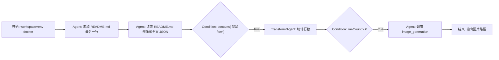

# Workflow / Flow Framework Research 2026-05-28

## 1. 目标

这份文档回答当前 Flow 产品下一步应该怎么设计，而不是重新引入 Vercel Workflow DevKit。

结论先写清楚：

- 继续保留 AI SDK、Chat agent loop、sandbox、hooks、compaction、permission/bypass 这些底座。
- 不要把 Flow Canvas 建在 Workflow DevKit 上；Flow 是产品层编排，Chat 是节点执行底座。
- Flow 的下一阶段核心不是“再画几个节点”，而是补运行态：run event log、后台任务、取消/重试、单节点调试、run replay、节点级 chat transcript。
- `gpt-image-2` 已经能通过本地 OpenAI-compatible Images API 真调用成功。短期继续作为 Chat tool 给 Flow agent 节点调用；中期把它收进统一 tool/plugin registry，而不是在 Flow executor 里硬编码 curl。

## 2. 当前 ai-sdk-demo 基线

当前仓库事实：

- 前端 Flow 画布使用 `@xyflow/react`。
- 已有持久化表：`flows`、`flow_nodes`、`flow_edges`、`flow_runs`、`flow_node_runs`。
- Flow executor 在 `lib/flows/executor.ts`。
- agent/prompt 节点已经通过 `runChatAgentLoop()` 执行，不再走单独的弱版 LLM 调用。
- 每个 agent 节点会创建 archived chat thread，`flow_node_runs.transcript_thread_id` 保存该 thread id。
- 图片生成能力已经是 Chat tool：`lib/tools/image-generation.ts` 里的 `image_generation`，使用 AI SDK `generateImage()` 和 `gateway.imageModel(env.gateway.imageModelId)`，产物保存到 workspace。
- Workflow DevKit 已经从 chat runtime 中移除；`GET /.well-known/workflow/v1/flow` 应该保持 404。

当前缺口：

- 没有 `flow_run_events` 这种 append-only 事件日志，导致 UI 很难精确还原“节点何时 queued / active / done / failed / waiting”。
- 没有真正的 Flow background task registry；运行仍偏同步，取消/恢复/长工具输出都不够完整。
- node run 状态还比较粗，缺少 `waiting_for_tool`、`waiting_for_approval`、`retrying`、`interrupted` 之类的运行态。
- 缺少 flow definition version/snapshot；历史 run 应该绑定当时的图，而不是总受当前画布修改影响。
- 缺少统一 plugin/tool registry；现在工具是 Chat tools，Flow 能间接用，但没有产品层可视化的能力声明、配置、权限、输出 schema。
- 缺少类似 n8n/Coze 的单节点测试、从某节点开始运行、失败节点重跑、run records 列表和 run detail 切换。

## 3. 用户给定文章要点

### Coze 产品定位

来源：

- [Coze（扣子）：免费创建个人智能体和工作流](https://aisharenet.com/cozekouzi_mian/)
- [Coze multi-agent mode tutorial](https://www.1ai.net/en/17951.html)
- [如何用 Coze 制作一个信息检索 Bot](https://juejin.cn/post/7336841191772143642)
- [玩转 Coze，我帮开源 AI 社区搞了一个社群运营机器人](https://juejin.cn/post/7365704703362269184)

可借鉴点：

- Coze 把复杂 bot 拆成多个 Agent。每个 Agent 可以有独立 prompt、plugins、workflow、knowledge base，调试时只修问题 Agent。
- Coze multi-agent 的节点不只是“执行步骤”，也可以是会回复用户的 Agent/Bot。对我们来说，Flow node run detail 应该天然能打开 chat transcript。
- Coze 有“起始节点”和“从上次回复节点继续”两种会话起点语义。对我们来说，Flow run 可以先只做每次从 Start 跑，但后续要支持 sessionized flow，也就是用户继续一次 flow conversation 时从 active node 继续。
- Coze 信息检索 workflow 的典型形态是：输入变量 -> 搜索插件 -> 格式化结果 -> 获取语言偏好 -> LLM 生成 -> 输出。对我们来说，必须把 input/output schema、变量映射、插件节点、一键测试做扎实。
- Coze 社群机器人文章强调定时推送、自定义 API、Bot 协作。对我们来说，trigger/schedule 是第二阶段能力，不要第一阶段就压进 executor，但数据库设计要预留。

### n8n 产品定位

来源：

- [n8n Review](https://www.upskillist.com/blog/n8n-review/)
- [n8n GitHub](https://github.com/n8n-io/n8n)

可借鉴点：

- n8n 的优势不是只有 trigger/action，而是分支、循环、并行、fallback、执行日志、自托管、可视化调试。
- 它的 UI 对新手会显得复杂。我们的 Flow 不能一开始就铺满参数表，应该把常用路径放在第一屏：创建 flow、添加节点、运行、看 run record、点击节点看 chat。
- n8n 的执行日志是产品核心。对我们来说，run history 不能只是一个状态 badge，必须是可回放的事件流。

## 4. AgentScope 借鉴点

来源：

- [AgentScope background tasks API](https://docs.agentscope.io/api-reference/background-tasks/list-running-background-tasks-for-a-session)
- [AgentScope Agent Service](https://docs.agentscope.io/v2/deploy/agent-service)

AgentScope 的重点不是画布，而是 agent service 运行态：

- session 是运行态单位，agent 是可复用模板。
- 支持 SSE 事件流和 buffered replay，断线后可以补历史。
- 支持 background task offloading，长工具可以放后台，并能列出和取消。
- workspace 是 agent 的运行环境，可以 local、Docker、E2B。
- schedule 是持久资源，服务重启后还能继续。

对 ai-sdk-demo 的设计建议：

- Flow run 应该像 session 一样被对待，而不是一次 POST 的副作用。
- 新增 `flow_run_events`，让 UI 从事件日志恢复状态，而不是只读最终 node run row。
- 新增 `flow_run_tasks` 或统一 `background_tasks`，至少包含 `task_id`、`flow_run_id`、`node_run_id`、`status`、`started_at`、`updated_at`、`cancelled_at`。
- 加 API：
  - `GET /api/flows/[flowId]/runs/[runId]/events`
  - `GET /api/flows/[flowId]/runs/[runId]/tasks`
  - `POST /api/flows/[flowId]/runs/[runId]/cancel`
  - `POST /api/flows/[flowId]/runs/[runId]/nodes/[nodeRunId]/retry`

## 5. PilotDeck 借鉴点

来源：

- [OpenBMB/PilotDeck](https://github.com/OpenBMB/PilotDeck)

PilotDeck 适合借鉴运行系统和可观察性，不适合直接搬 UI 或整套后端。

值得吸收：

- Workspace-level isolation：Flow 绑定 workspace 是对的，节点工具执行必须继承 workspace root。
- White-box memory：未来每个 flow/node 可以有自己的 memory/knowledge 边界，不能所有 flow 混一个大记忆池。
- Smart routing/cost optimization：未来可做节点级 model policy，简单 transform/判断不用重模型。
- Always-on background execution：Flow 不应该只支持手动点击运行，还要支持定时/后台任务。
- Append-only event store / JSONL transcript：Flow run detail 应该从事件日志和 transcript 重放，而不是只看最终字段。
- Background task runtime：长 shell、图片生成、爬取、索引这类工具都需要可列出、可取消、可看 stdout/stderr。
- Tool registry：插件能力要注册、列举、生成 schema，而不是散落在 executor switch 里。

建议落地：

- 先在 SQLite 增加结构化事件表，不急着上 JSONL 文件。
- Tool/plugin registry 可以先复用 Chat toolset 生成逻辑，再加 Flow 专用 metadata。
- Always-on/schedule 放 Phase 3，不要影响现在手动运行的闭环。

## 6. DeepSeek-Reasonix 借鉴点

来源：

- [DeepSeek-Reasonix README.zh-CN](https://github.com/esengine/DeepSeek-Reasonix/blob/main/README.zh-CN.md)
- 本地调研文件：`/tmp/ai-workflow-research/DeepSeek-Reasonix`

Reasonix 不是视觉 workflow 框架，它更像一个稳定的 Chat/Agent runtime 参考。

值得吸收：

- event taxonomy：`session.opened`、`model.turn.started`、`model.delta`、`tool.preparing`、`tool.dispatched`、`tool.result`、`session.compacted` 这种事件分层，适合我们做 Flow run event。
- tool-call healing：丢弃不成对 tool call、修补缺失 tool id、压缩超长工具结果，能直接缓解之前 token-budget 膨胀问题。
- cache/context discipline：Flow node chat transcript 和 model-visible context 要分离；UI 历史不等于模型输入。
- replay/debug 命令思想：Flow run detail 应该可以从事件日志重建一次运行，而不是只展示最后输出。

建议落地：

- 给 Chat runtime 增加更清晰的 event emitter，再由 Flow executor 订阅并写入 `flow_run_events`。
- 在 Flow node transcript 中保存安全可见内容；隐藏推理不落库。
- 工具输出进入模型前继续走压缩/截断策略，尤其是 shell/read/search 类工具。

## 7. 其他开源框架参考

### LangGraph

来源：[LangGraph docs](https://langchain-ai.github.io/langgraph/)

定位：状态图、checkpoint、thread/memory。适合需要复杂可恢复状态图时作为后端执行引擎参考。

建议：现在不要直接替换 executor。等我们需要强并发、人工中断后恢复、多 checkpoint graph 时再评估。

### Langflow

来源：[Langflow GitHub](https://github.com/langflow-ai/langflow)

定位：可视化 AI workflow authoring、playground、API/MCP server。适合参考节点面板、playground、导入导出 JSON。

建议：借鉴 UX，不直接嵌入。它的 Python/后端生态和当前 Next/AI SDK 栈不完全一致。

### Flowise

来源：[Flowise GitHub](https://github.com/FlowiseAI/Flowise)

定位：Visual AI agents builder，节点生态丰富。

建议：适合参考节点市场、凭据配置、工具节点 schema。不要整套移植，否则会把产品变成另一个 Flowise。

### n8n

来源：[n8n GitHub](https://github.com/n8n-io/n8n)

定位：通用自动化工作流，集成多、执行日志成熟。

建议：借鉴 run history、execution logs、node test、credential/integration UI。不要复制全部自动化平台复杂度。

### Inngest / Temporal / Trigger.dev / Hatchet

定位：durable execution / background jobs / step retry。

建议：

- Phase 1 继续用本地 SQLite + in-process runner。
- 当 Flow 需要跨进程、服务重启恢复、队列并发控制时，再选一个 durable worker。
- 如果走 TypeScript-first，优先评估 Inngest/Hatchet/Trigger.dev；如果要强一致长事务，再评估 Temporal。

## 8. 推荐产品形态

一级页面结构：

- `Chat`
- `Flows`

Flows 页内部建议分三层：

- Flow 列表：所有 flow、所属 workspace、最近运行状态、创建按钮。
- Flow 编辑/详情：画布、节点配置、边配置、输入输出 schema、变量映射。
- Run records：某个 flow 的运行记录列表，点击进入一次 run detail。

Run detail UX：

- 左侧仍然是画布，但画布显示这次 run 的状态，而不是编辑态状态。
- 节点状态明确：`queued`、`active`、`waiting`、`done`、`failed`、`cancelled`、`skipped`。
- 点击节点打开右侧详情：
  - 节点配置快照
  - 本次 input JSON
  - 本次 output JSON
  - trace/events
  - transcript thread
  - tool calls
  - error/retry/cancel 信息
- 右侧面板必须独立滚动，底部内容不能被挡住。

编辑态 UX：

- 创建 workflow 用大弹窗或 full-page editor，默认接近 90% 视口，并提供全屏按钮。
- 添加节点要更像 Coze/n8n：从节点库选择，而不是让用户猜 JSON。
- 每个节点有“测试此节点”“从此节点运行”“保存为模板”。
- 条件边的配置要表单化：字段 path、operator、value，而不是只给 raw JSON。

## 9. 推荐运行架构

### 9.1 Source of truth

Flow 定义：

- `flows`
- `flow_nodes`
- `flow_edges`
- 后续新增 `flow_versions` 或 run snapshot

Flow 运行：

- `flow_runs`
- `flow_node_runs`
- 新增 `flow_run_events`
- 新增 `flow_run_tasks`

Chat transcript：

- 继续使用 `threads` / `messages`
- Flow node run 只保存 `transcript_thread_id`

工具/插件：

- 先由 Chat toolset 统一提供
- 后续增加 `tool_registry` / `flow_plugins` metadata

### 9.2 Run snapshot

每次创建 `flow_run` 时保存当时的 graph snapshot：

```ts
type FlowRunSnapshot = {
  flow: FlowDefinition;
  nodes: FlowNode[];
  edges: FlowEdge[];
  version: number;
};
```

这样用户改画布后，历史 run detail 仍能看见当时执行的图。

### 9.3 Event log

建议事件类型：

```ts
type FlowRunEvent =
  | { type: "flow.run.created"; runId: string }
  | { type: "flow.run.started"; runId: string }
  | { type: "flow.run.finished"; runId: string; status: string }
  | { type: "node.queued"; nodeRunId: string; nodeId: string }
  | { type: "node.started"; nodeRunId: string; nodeId: string }
  | { type: "node.chat.thread.created"; nodeRunId: string; transcriptThreadId: string }
  | { type: "node.tool.started"; nodeRunId: string; toolName: string; toolCallId: string }
  | { type: "node.tool.finished"; nodeRunId: string; toolName: string; toolCallId: string }
  | { type: "node.finished"; nodeRunId: string; status: string }
  | { type: "node.failed"; nodeRunId: string; error: string }
  | { type: "flow.cancel.requested"; runId: string };
```

UI 不应该自己猜“哪个节点 active”；它应该从 node run row + event log 派生。

### 9.4 Background task

短期：

- in-process `FlowTaskRegistry`
- 每个 run 一个 `AbortController`
- API 可 cancel run
- 进程重启时把 running 标为 interrupted

中期：

- `flow_run_tasks` 持久化 task 状态
- 长工具输出落库或落文件
- run detail 可以看 stdout/stderr/output chunks

长期：

- durable worker / queue
- schedule trigger
- 多 runner 并发控制

## 10. 插件化与 image-2 结论

本轮验证没有保存任何密钥。

当前本地 OpenAI-compatible endpoint 验证结果：

```json
{"status":200,"modelCount":15,"hasGptImage2":true}
{"status":200,"dataCount":1,"hasB64Json":true,"b64Length":1019236,"hasUrl":false}
```

结论：

- `gpt-image-2` 不只是出现在模型列表里，`/images/generations` 也能真返回 base64 图片。
- 现在最合理的接法是继续让 `image_generation` 作为 Chat tool 存在，Flow agent 节点通过 Chat 底座调用它。
- 不建议在 Flow executor 中加一个 `if image then curl` 的特殊分支；这会让 Flow 绕过 Chat 的权限、sandbox、trace、abort、tool result 规范。
- 可以新增一个插件层，让 image tool 变成可声明能力：

```ts
type ToolPlugin = {
  id: string;
  title: string;
  description: string;
  category: "workspace" | "media" | "web" | "code" | "custom";
  inputSchema: unknown;
  outputSchema: unknown;
  permissions: string[];
  createTool: (ctx: ToolPluginContext) => unknown;
};
```

插件形态建议：

- 内部插件：`plugins/internal/image-generation`，直接复用 AI SDK `generateImage()`。
- 外部插件：`plugins/external/openai-compatible-image`，允许配置 base URL/model/key，从 provider adapter 调用 Images API。
- curl 只能作为 adapter 内部实现或调试手段，不作为 Flow 产品层的直接能力。

## 11. 分阶段实施路线

### Phase 1：把当前 Flow 做成可用的 Coze/n8n 式 MVP

目标：用户能创建、编辑、运行、查看历史、点击节点看完整 chat。

改动：

- `app/_components/FlowWorkspace.tsx`
  - 改成“列表 / 编辑详情 / 运行记录”清晰结构。
  - 运行记录点击后进入 run detail mode。
  - run detail 中点击节点显示本次 node run 的 transcript。
  - 修复右侧面板滚动。
  - 所有英文 label 改中文。
- `app/api/flows/**`
  - 补 run detail / node run detail 所需数据。
- `lib/flows/executor.ts`
  - 执行时先写 queued/started events。
  - node status 更细。

验收：

- 创建 flow 后能在列表看到。
- 添加 Start -> agent -> condition -> agent/image -> End 这类链路。
- 点击运行后立刻出现一条 run record。
- 运行中节点显示 active，完成节点显示 done，未执行节点显示 pending/queued。
- 点击节点能看到这次 run 的 chat transcript 和输出 JSON。

### Phase 2：事件日志、单节点调试、重试/取消

目标：把“可看”变成“可调试”。

改动：

- 新增 `flow_run_events`。
- 新增 `flow_run_tasks` 或先建 `FlowTaskRegistry`。
- 增加 cancel run API。
- 增加 retry node / run from node API。
- 增加 node test 输入面板。

验收：

- 刷新页面后 run detail 状态不丢。
- 运行中可取消。
- 失败节点可重试。
- 单节点测试不会污染正式 run 历史，或者明确标为 debug run。

### Phase 3：插件市场和触发器

目标：让 Flow 成为用户配置能力，而不是开发者写死能力。

改动：

- Tool/plugin registry。
- 插件元数据：schema、权限、分类、图标、是否需要 workspace。
- credential/profile 管理。
- trigger：manual、schedule、webhook。
- node template：搜索、读取文件、生成图片、执行命令、调用子 agent。

验收：

- 用户能在节点库选择“生成图片”。
- 用户能在节点表单里配置 prompt/input/output，而不是写 executor 代码。
- schedule 可以产生 run record。

### Phase 4：持久 worker / 多运行器

目标：真正支持后台长任务和重启恢复。

改动：

- 引入 durable queue 或 worker。
- executor 可从 run snapshot 恢复。
- stdout/stderr/chunks 落库或落文件。
- 并发限制、租约、心跳、超时。

验收：

- 服务重启后 running run 不会静默消失，会明确变成 interrupted 或继续恢复。
- 长图像生成/长 shell 有 task 输出和 cancel。

## 12. 不建议做的事

- 不要重新引入 Vercel Workflow DevKit 来解决 Flow 产品问题。它和用户想要的“可视化 workflow 产品”不是同一层。
- 不要直接嵌入 n8n/Flowise/Langflow 作为核心。它们会带来另一套运行时、插件生态、权限模型和 UI 复杂度。
- 不要在 Flow executor 里为图片、curl、shell 写越来越多特殊分支。所有能力应该走统一 tool/plugin registry。
- 不要把 UI transcript 当成模型输入事实源。模型输入必须继续走 active context / compaction 规则。
- 不要隐藏运行过程。Flow 的核心卖点应该是 run detail 和节点级 chat 可观察性。

## 13. 下一步建议

最小可执行下一步：

1. 在数据库增加 `flow_run_events` 和 run graph snapshot。
2. 修改 `executeFlowRun()`，在 run/node 生命周期写 events。
3. 修改 Flow UI，把页面分成：
   - Flow 列表
   - 编辑/详情
   - 运行记录
   - run detail
4. run detail 读取 events + node runs，点击节点显示 transcript。
5. 把 image generation 标记为一个可展示的内置插件，但底层仍复用现有 Chat tool。

这样做之后，用户说的 flow 示例可以自然落地：

- 选择 `env-docker` workspace。
- Start 节点输入。
- agent 节点写入 `README.md` 最后一行“我是 flow”。
- agent 节点读取并输出完整 `README.md`。
- condition 节点判断是否包含“我是 flow”。
- transform/agent 节点输出行数。
- condition 节点判断行数大于 0。
- image agent 节点调用 `image_generation`，输出图片路径。

关键是：每一步都是 node run，每一步都能点进去看 chat、tool call、输出和状态。

## 14. 实现级证据记录

本节补充源码级调研记录，避免只停留在产品概念层。调研快照：

- AgentScope: `agentscope-ai/agentscope` at `4806d6c`
- PilotDeck: `OpenBMB/PilotDeck` at `e0cd38d`
- DeepSeek-Reasonix: `esengine/DeepSeek-Reasonix` at `984e830`

### 14.1 AgentScope: session/run/task 是独立资源

源码入口：

- `/tmp/ai-workflow-research/agentscope/src/agentscope/app/_router/_background_task.py`
- `/tmp/ai-workflow-research/agentscope/src/agentscope/app/_manager/_background_task_manager.py`
- `/tmp/ai-workflow-research/agentscope/src/agentscope/app/_manager/_session_manager.py`
- `/tmp/ai-workflow-research/agentscope/src/agentscope/app/_service/_chat.py`
- `/tmp/ai-workflow-research/agentscope/src/agentscope/app/_middleware/_tool_offload_middleware.py`
- `/tmp/ai-workflow-research/agentscope/src/agentscope/app/_manager/_scheduler/_scheduler_manager.py`

关键实现：

- `GET /background-tasks/{session_id}` 不是查数据库历史，而是从 `BackgroundTaskManager.tasks` 里按 `session_id` 过滤当前 running task，返回 `task_id/session_id/agent_id`。
- `DELETE /background-tasks/{session_id}/{task_id}` 先校验 task 是否属于 session，然后 `task.asyncio_task.cancel()`；取消后不会调用 `on_complete`，因此不会把完成结果重新注入 agent context。
- `BackgroundTaskManager` 同时管三件事：
  - running task registry: `OrderedDict[str, BackgroundTask]`
  - completed result storage: `_completed_results: dict[str, list[Any]]`
  - TaskStop 工具：agent 自己也能停止后台 task。
- `ToolOffloadMiddleware` 在 tool 执行超过 timeout 后，不取消原 task，而是：
  - 把正在执行的 tool drain task 注册进 `BackgroundTaskManager`
  - 立刻给 agent 返回 synthetic tool response，告诉它 task id
  - 真正完成后将 `<system-notification>` 结果写入 manager
  - 如果 session 已 idle，则自动 retrigger `ChatService.stream_chat(...)`
- `SessionManager` 把 session run 抽象成 `_SessionRun`：
  - `buffer: list[AgentEvent]` 保存当前 run 已产生事件
  - `subscribers: list[asyncio.Queue]` 支持多个 SSE subscriber
  - `publish(event)` 同时 append buffer 和 fan-out
  - `subscribe(session_id)` 先注册 queue 再 replay buffer，避免订阅瞬间漏事件
  - 每个 `session_id` 只有一个 lock，保证同一 session 串行执行
- `ChatService.stream_chat(...)` 是 HTTP chat 和 schedule trigger 的统一入口。调度器不直接跑 agent，而是构造 `ChatService` 后 drain stream。
- `SchedulerManager` 持久化 schedule；启动时 restore，触发时可选择 stateful session 或 fresh session。
- Workspace 的 `offload_context` / `offload_tool_result` 把大上下文和大工具结果落到 `sessions/<session_id>/...`，而不是塞回模型上下文。

对我们的直接启发：

- Flow run 必须成为运行态资源，不能只是 `POST /runs` 同步返回。
- 要有 `FlowRunManager`：
  - 每个 `flowRunId` 一个 active run
  - 事件 buffer + subscriber
  - 同一个 flow run 不允许并发修改状态
  - 支持 `GET /events` replay 和 SSE live subscribe
- 要有 `FlowTaskManager`：
  - `list(flowRunId)` / `cancel(taskId)` / `pushResult(nodeRunId, result)` / `popResults(nodeRunId)`
  - 长工具、图像生成、shell、crawl 都走 task registry
- Flow executor 应该和 schedule/manual/API 共用一个 `FlowService.runFlow(...)` 入口。
- Flow 未来的 schedule trigger 不应该绕过 FlowService。

### 14.2 PilotDeck: 事件、任务、transcript、tool registry 都很可抄

源码入口：

- `/tmp/ai-workflow-research/PilotDeck/src/always-on/storage/AlwaysOnEventStore.ts`
- `/tmp/ai-workflow-research/PilotDeck/src/task/runtime/BackgroundTaskRuntime.ts`
- `/tmp/ai-workflow-research/PilotDeck/src/task/storage/TaskOutputStore.ts`
- `/tmp/ai-workflow-research/PilotDeck/src/session/transcript/JsonlTranscriptWriter.ts`
- `/tmp/ai-workflow-research/PilotDeck/src/tool/registry/ToolRegistry.ts`
- `/tmp/ai-workflow-research/PilotDeck/src/agent/session/AgentSession.ts`
- `/tmp/ai-workflow-research/PilotDeck/src/agent/loop/AgentLoop.ts`
- `/tmp/ai-workflow-research/PilotDeck/ui/src/components/main-content-v2/RunDetail.tsx`

关键实现：

- `AlwaysOnEventStore` 极简但方向正确：
  - `appendEvent(event)` 追加 JSONL
  - `readEvents({ since, limit })` 读取、容错跳过坏行、按时间倒序、支持 limit
- `BackgroundTaskRuntime` 是 detached child process runtime：
  - `start(spec)` spawn detached child，`child.unref()`
  - stdout/stderr 进入 `TaskOutputStore`
  - `stop(taskId)` 先 SIGTERM，grace timeout 后 SIGKILL
  - `killForAgent(agentId)` 和 `killAll()`
  - `maxTasks` 防止无限开任务
- `TaskOutputStore` 是很适合我们复用的模型：
  - 默认 1MB memory ring buffer
  - `totalBytes()` 单调递增
  - `readSlice(offset, maxBytes)` 支持 UI 轮询增量输出
  - 可选 disk spill，内存只保留窗口
- `JsonlTranscriptWriter` 的 transcript 是 append-only：
  - 每条 entry 有 `sequence`、`entryId`、`parentEntryId`
  - `restoreState(...)` 支持 resume 后继续写唯一序号
  - subagent 用 sidechain transcript，父 transcript 只保留摘要和相对路径
- `ToolRegistry` 是我们插件化最该先借鉴的小实现：
  - register/get/list
  - alias
  - `toCanonicalSchemas()`
  - clone/replace/unregister
- `AgentSession` 暴露 `submit`、`abort`、`snapshot`、`snapshotForRuntimeReload`、`replay`，这比我们的 Flow run 当前状态完整。
- `AgentLoop` 有自动 compaction、context budget event、router decision、prompt-too-long 处理、invalid tool call circuit breaker。
- `RunDetail.tsx` 不是画布编辑器，但它体现了“run detail 需要 plan/report/status/execution session link”这种详情页组织方式。

对我们的直接启发：

- `flow_run_events` 第一版可以先用 SQLite；如果后续需要文件级耐久/低写放大，可再加 JSONL mirror。
- `flow_task_outputs` 或 `.data/flow-task-output/<taskId>.log` 可以仿 `TaskOutputStore`：
  - UI 用 offset 拉增量
  - 节点详情展示 stdout/stderr
  - 不把长输出塞进 `trace_json`
- `flow_node_runs.transcript_thread_id` 现在已经对了；下一步要给 transcript 加更明确的事件索引和父子关联。
- 插件系统第一版就做 `ToolRegistry` 风格，不要上来做复杂 marketplace。

### 14.3 Reasonix: Chat 底座要更像事件内核

源码入口：

- `/tmp/ai-workflow-research/DeepSeek-Reasonix/src/core/eventize.ts`
- `/tmp/ai-workflow-research/DeepSeek-Reasonix/src/loop/healing.ts`
- `/tmp/ai-workflow-research/DeepSeek-Reasonix/src/loop/shrink.ts`
- `/tmp/ai-workflow-research/DeepSeek-Reasonix/src/loop.ts`
- `/tmp/ai-workflow-research/DeepSeek-Reasonix/src/adapters/event-sink-jsonl.ts`

关键实现：

- `Eventizer` 把 loop event 翻译为稳定 UI/持久事件：
  - `session.opened`
  - `session.compacted`
  - `model.turn.started`
  - `model.delta`
  - `model.final`
  - `tool.preparing`
  - `tool.intent`
  - `tool.dispatched`
  - `tool.result`
  - `tool.confirm.allow/deny/always_allow`
  - `status`
  - `error`
- `Eventizer` 会维护 tool call FIFO：
  - tool call delta 先变成 `tool.preparing`
  - tool_start 升级成 intent/dispatched
  - tool result 再和 inflight call id 配对
- `fixToolCallPairing` 会丢弃 unpaired assistant tool calls 和 stray tool messages；这是防止模型 API 400 的关键。
- `healLoadedMessagesByTokens` 同时做：
  - 按 token 收缩 tool result
  - 修复 tool call pairing
  - 收缩 oversized tool call args
- `shrinkOversizedToolResultsByTokens` 只截断 tool-role 内容，不动 user prompt。
- `shrinkOversizedToolCallArgsByTokens` 只收缩 JSON 参数里的长字符串，保留短 key/path/id，避免破坏工具语义。

对我们的直接启发：

- Chat runtime 应该暴露一个内部 event emitter，Flow executor 只订阅事件并写 `flow_run_events`，不要在 Flow 里解析 UI chunk 猜 tool 状态。
- Flow 的 run detail 应该展示 Reasonix 风格的事件时间线：
  - model started/final
  - tool preparing/dispatched/result
  - compaction
  - budget
  - error
- 当前 token-budget 爆炸历史说明我们也需要 tool-call healing 层，尤其是 flow node transcript 复用 chat 历史时。

## 15. 可加速框架候选矩阵

| 框架 | 主要价值 | 对我们是否直接采用 | 推荐吸收点 |
| --- | --- | --- | --- |
| AgentScope | Agent service、session、background task、schedule、workspace offload | 不直接采用，语言/栈不同；强烈借鉴运行态 | `FlowRunManager`、`FlowTaskManager`、session replay、tool offload/retrigger |
| PilotDeck | Workspace 隔离、event store、background task runtime、transcript、tool registry | 不直接采用，AGPL 且系统很大；强烈借鉴模块形状 | JSONL/SQLite event log、1MB task output ring buffer、ToolRegistry、RunDetail |
| DeepSeek-Reasonix | 稳定 Chat loop、事件化、tool-call healing、缓存纪律 | 不替换；借鉴 Chat runtime 硬化 | Eventizer、tool result shrink、tool call pairing repair、cost/context telemetry |
| Langflow | 可视化 AI workflow，API/MCP server，step-by-step playground | 不直接嵌入，Python/LangChain 栈较重 | 节点库、playground、flow export JSON、MCP 化 |
| Flowise | Visual AI agents builder，节点生态和 agent/RAG 模板 | 不直接嵌入 | 节点市场、凭据配置、agent 节点模板 |
| Dify | LLM app platform，workflow/RAG/agent/model/observability 一体 | 不直接嵌入，平台边界太大 | app/workflow 分层、observability、prompt IDE、发布态概念 |
| n8n | 400+ integration、视觉自动化、代码节点、run logs | 不直接嵌入，license/复杂度不适合做底座 | execution logs、node test、credential/integration UI、版本/模板 |
| Activepieces | Zapier 替代，pieces 插件生态，版本恢复，AI/code builder | 不直接嵌入 | pieces 插件模型、flow version restore、简单 builder |
| Windmill | Code-first workflow/internal tools/job orchestrator | 不用于画布，适合参考 worker/脚本任务 | 脚本节点、job orchestrator、Git-based collaboration |
| Trigger.dev | TypeScript AI workflows、long-running task、retry、queue、realtime、waitpoints | 中期可评估作为后台 worker | durable tasks、run subscription、waitpoints、versioning、observability |
| Hatchet | durable task queue，AI agents/background workflows | 中期可评估 | queue/concurrency、worker model、multi-language SDK |
| Temporal | 最强 durable execution | 暂不引入，运维和确定性约束太重 | history replay、activity retry、workflow versioning |
| LangGraph | StateGraph/checkpoint/thread memory | 后期复杂图状态可评估 | checkpoint、thread state、resume semantics |

公开资料核对记录：

- Langflow README 明确定位为 building/deploying AI-powered agents and workflows，提供 visual authoring、API/MCP server、interactive playground、multi-agent orchestration、JSON export、observability。
- Flowise README 明确是 “Build AI Agents, Visually”，仓库模块包括 `server`、`ui`、`components`、`api-documentation`，适合参考节点集成生态。
- n8n README 明确是 workflow automation platform，强调 400+ integrations、native AI capabilities、visual building + custom code、self-host、templates。
- Dify README 明确是 open-source LLM app development platform，组合 AI workflow、RAG pipeline、agent、model management、observability，并有 visual canvas workflow。
- Activepieces README 明确是 open-source Zapier replacement，核心是 TypeScript pieces framework，pieces 可作为 MCP servers 使用，适合参考插件生态。
- Windmill README 明确是 developer platform for APIs/background jobs/workflows/UIs，脚本可自动生成 UI 并组成 flows，适合参考 code-first node 和 job runner。
- Trigger.dev README 明确面向 TypeScript AI workflows，提供 long-running tasks、retries、queues、observability、elastic scaling、realtime subscription、human-in-the-loop。
- Hatchet README 明确是 background tasks、AI agents、durable workflows orchestration engine，提供 queue、retries、durability、monitoring、logging、Postgres durability layer。
- LangGraph README 明确是 low-level orchestration framework for long-running/stateful agents，提供 durable execution、human-in-the-loop、memory、debug/observability。

当前最现实的加速方式不是“把某个框架搬进来”，而是采用以下组合：

1. UI/canvas 继续用现有 `@xyflow/react`。
2. 执行底座继续用现有 Chat agent loop + AI SDK + sandbox。
3. 运行态学习 AgentScope/PilotDeck：event log、task registry、subscriber/replay、schedule。
4. Chat 可靠性学习 Reasonix：eventizer、tool-call healing、tool result shrink。
5. 后台持久化 worker 到 Phase 4 再评估 Trigger.dev/Hatchet/Temporal。

## 16. 建议新增的本项目模块

### 16.1 后端模块

建议新增或扩展：

- `lib/flows/run-manager.ts`
  - 管理 active flow runs
  - per-run lock
  - in-process subscriber
  - restart 时 mark interrupted
- `lib/flows/event-store.ts`
  - `appendFlowRunEvent(event)`
  - `listFlowRunEvents(runId, { since, limit })`
  - 可选 SSE encoder
- `lib/flows/task-manager.ts`
  - 管理后台任务
  - `startTask({ flowRunId, nodeRunId, kind })`
  - `cancelTask(taskId)`
  - `readTaskOutput(taskId, offset)`
- `lib/tools/registry.ts`
  - 从现有 Chat tools 注册 canonical tool metadata
  - Flow 节点库从这里生成可选能力
- `lib/chat-agent/events.ts`
  - Chat loop 内部事件模型
  - Flow executor 订阅这些事件，写入 `flow_run_events`
- `lib/chat-agent/healing.ts`
  - tool call pairing repair
  - tool output/token shrink

### 16.2 数据库表

建议新增：

```sql
CREATE TABLE flow_run_events (
  id TEXT PRIMARY KEY,
  flow_run_id TEXT NOT NULL,
  node_run_id TEXT,
  sequence INTEGER NOT NULL,
  type TEXT NOT NULL,
  payload_json TEXT NOT NULL,
  created_at INTEGER NOT NULL
);

CREATE INDEX idx_flow_run_events_run_sequence
  ON flow_run_events(flow_run_id, sequence);

CREATE TABLE flow_run_tasks (
  id TEXT PRIMARY KEY,
  flow_run_id TEXT NOT NULL,
  node_run_id TEXT,
  kind TEXT NOT NULL,
  status TEXT NOT NULL,
  output_offset INTEGER NOT NULL DEFAULT 0,
  started_at INTEGER NOT NULL,
  updated_at INTEGER NOT NULL,
  finished_at INTEGER,
  error TEXT
);

CREATE INDEX idx_flow_run_tasks_run
  ON flow_run_tasks(flow_run_id, started_at DESC);
```

建议扩展：

```sql
ALTER TABLE flow_runs ADD COLUMN graph_snapshot_json TEXT;
ALTER TABLE flow_runs ADD COLUMN interrupted_at INTEGER;
ALTER TABLE flow_node_runs ADD COLUMN attempt INTEGER NOT NULL DEFAULT 1;
```

### 16.3 API

建议新增：

- `GET /api/flows/[flowId]/runs/[runId]/events`
- `GET /api/flows/[flowId]/runs/[runId]/events/stream`
- `GET /api/flows/[flowId]/runs/[runId]/tasks`
- `POST /api/flows/[flowId]/runs/[runId]/cancel`
- `POST /api/flows/[flowId]/runs/[runId]/nodes/[nodeRunId]/retry`
- `POST /api/flows/[flowId]/nodes/[nodeId]/test`
- `POST /api/flows/[flowId]/runs/from-node`
- `GET /api/flow-tools`

### 16.4 前端组件

建议拆分 `FlowWorkspace.tsx`，避免继续堆成巨型组件：

- `FlowListView`
- `FlowEditorView`
- `FlowRunsPanel`
- `FlowRunDetailView`
- `FlowNodeInspector`
- `FlowNodeRunInspector`
- `FlowEventTimeline`
- `FlowTaskOutputPanel`
- `FlowToolPicker`

## 17. 目标 Flow 示例的推荐执行图

用户给的测试 flow 可以作为 Phase 1/2 的验收样例：



每个节点的 run detail 应该至少显示：

- node config snapshot
- input JSON
- output JSON
- status timeline
- transcript thread
- tool calls
- generated files
- error / retry information

验收标准：

- 点击运行后立即出现 run record。
- `B` active 时，`C/D/E/F/G/H` 是 queued/pending。
- `B` 完成后状态变 done，`C` active。
- 任一节点失败后后续节点 skipped 或 pending，不能无声停住。
- 点击 `G` 节点能看到 `image_generation` tool call 和图片路径。

## 18. 调研后的最终判断

我们当前 Flow 的方向是对的：**native Flow Canvas + Chat substrate**。问题不是选错底座，而是运行态层还太薄。

最优设计不是迁移到某个大框架，而是补齐四个内核能力：

1. **事件内核**：所有 run/node/tool/model 变化写 append-only event。
2. **任务内核**：长工具、图片、shell 等可 list/cancel/read-output。
3. **transcript 内核**：节点级 chat 可 replay，历史 run 绑定 graph snapshot。
4. **插件内核**：Chat 和 Flow 共享 tool registry，Flow 不写工具特殊分支。

这样既能保留我们已有的 AI SDK、sandbox、permission、hooks、compaction，也能把 UX 做到接近 Coze/n8n：创建 flow、配置节点、运行、查看记录、点击节点进入完整 chat 思考和输出。

## 19. 2026-05-28 Native Flow implementation kickoff

已开始按本调研结论推进 Native Flow runtime 的第一片底座。

本次落地范围：

- `flow_runs.graph_snapshot_json`
  - 每次创建 flow run 时捕获当时的 flow/node/edge graph snapshot。
  - 目标是让历史运行记录不被后续画布编辑污染。
- `flow_run_events`
  - 新增 append-only 事件表。
  - 当前事件按 `flow_run_id + sequence` 顺序读取。
- executor 生命周期事件
  - `flow.run.started`
  - `node.queued`
  - `node.started`
  - `node.chat.thread.created`
  - `node.finished`
  - `node.failed`
  - `node.enqueued`
  - `flow.run.finished`
  - `flow.run.failed`
- 查询 API
  - `GET /api/flows/[flowId]/runs/[runId]/events`

验证记录：

- `npx tsc --noEmit`
- `npm run lint`
- `git diff --check`
- 临时 SQLite 烟测：迁移到 v10，创建 flow/run，确认 `graphSnapshot` 存在，确认 `flow.run.started` 可写可读。

下一步建议：

- 在 Flow UI 的 run detail 中读取 `flow_run_events`。
- 用事件 timeline 替代前端猜测 active/done/pending。
- 再加 `FlowTaskManager`，覆盖长 shell、图片生成、crawl 的输出和取消。

## 20. 2026-05-29 Native Flow UI/runtime slice

本次继续按 Native Flow 方向推进，目标是让画布编辑、运行记录和节点级 agent transcript 更接近真实产品，而不是停留在演示逻辑。

已落地：

- 节点选择 UX
  - 修复点击节点后右侧默认强切到“运行详情”的问题。
  - 现在点击节点只改变当前选中节点；如果用户停留在“配置”，会看到对应节点的配置表单。
  - 如果用户手动切到“运行详情”，点击节点会切换当前节点的运行详情顺序。
- 运行详情 UI
  - Flow run detail 读取 `GET /api/flows/[flowId]/runs/[runId]/events`。
  - 新增“运行事件”时间线，展示 `flow.run.started`、`node.started`、`node.chat.thread.created`、`node.finished`、`flow.run.finished` 等事件。
- Flow agent 工具型节点收尾
  - 新增 `stopAfterCompletedToolCalls` 到 chat run options。
  - Flow agent 节点可配置 `useLastToolOutputAsOutput: true`，工具返回后直接把真实工具输出作为节点 output。
  - 解决“工具已经完成，但节点继续等待模型再补最终 JSON，导致 run 长时间 active”的问题。
- 真实样例 flow
  - 已创建 `Google News 图片生成流程`。
  - 工作区：`/Users/apple/Desktop/project/ai-sdk-demo`。
  - 节点：
    - `开始：输入新闻主题`
    - `抓取 Google News`
    - `生成新闻图片`
    - `结束：返回图片路径`
  - 抓取节点真实调用 `shell + curl` 访问 Google News RSS。
  - 图片节点真实调用 `image_generation`，模型为 `gpt-image-2`。
  - 输出目录：`.flow-artifacts/google-news-images/`。

实跑验证：

- flow id: `4981ef23-efbf-46bc-a6dc-3697c5a32cc9`
- 成功 run id: `fe000069-48d2-414d-9c1d-b859dda46a3e`
- 输出图片：
  - `.flow-artifacts/google-news-images/google-news-ai-latest.png`
  - 1024x1024 PNG
  - 约 2.0 MB
- 事件流验证：
  - 成功 run 写入 19 条事件。
  - 包含抓新闻节点和图片节点的 `node.chat.thread.created`。
  - 最终有 `flow.run.finished`。
- 前端验证：
  - 浏览器打开 `http://localhost:3000`。
  - Flows 列表可看到 `Google News 图片生成流程`。
  - 点击 `生成新闻图片` 节点后，右侧保持在“配置”，并显示该节点标题、提示词、输出结构。
  - 点击“运行详情”后，可看到流程 output、运行事件、节点 output 和 transcript。

代码验证：

- `npm run lint`
- `npx tsc --noEmit`
- `git diff --check`

后续建议：

- 把事件时间线从右侧窄栏升级成 run detail 主视图，支持按节点过滤。
- 给 transcript 加轮询或增量读取，运行中实时显示工具卡片，而不是只在节点完成后稳定展示。
- 对 `useLastToolOutputAsOutput` 做 UI 开关，当前主要通过节点 config JSON 持久化。
- 增加 run cancellation API，避免用户误触长耗时图片节点后只能等待。

## 21. 2026-05-29 Flow agent transcript completeness

用户在验证 `Google News 图片生成流程` 时发现：节点运行详情里的 agent 对话记录不完整。具体表现是工具型节点能看到工具调用，但不容易看出这条 user message 是谁发起的、Flow 自动传入了什么、工具完成后节点最终把什么作为响应。

原因判断：

- Flow agent 节点复用 chat agent loop，transcript thread 为 `flow-node:*`。
- 节点开始时会写入一条自动生成的 user message，内容包含节点 instruction、节点输入和输出要求。
- 对 `useLastToolOutputAsOutput: true` 的工具型节点，runtime 会在工具完成后直接把最后一次工具输出作为节点 output。
- 这会绕过“模型再补一段最终 assistant 文本”的阶段，所以旧 transcript 里可能只有 tool part，没有一段明确的 assistant final response。
- 这不是 AI SDK flow 的问题，也不是前端重复提交；这是 Native Flow runtime 对 tool-only 节点的 transcript 收尾语义不完整。

已落地修复：

- `lib/flows/executor.ts`
  - `buildPromptText(...)` 增加自动触发说明：
    - `This user message was generated automatically by the Flow runtime, not typed directly by the end user.`
  - 当 `useLastToolOutputAsOutput` 命中、且 assistant 没有最终文本时，追加一段 assistant text。
  - 追加文本说明 workflow runtime 使用已完成的工具输出作为本节点响应，并附带 JSON 输出。
- `app/_components/FlowWorkspace.tsx`
  - `TranscriptLoader` 透传 `nodeRun`。
  - `TranscriptBlock` 在完整消息上方展示 `Flow 自动触发` 摘要。
  - 摘要区展示：
    - 自动触发输入：`nodeRun.input`
    - 节点最终响应：`nodeRun.output`
  - 下方仍保留完整 chat transcript，包括 user message、tool input、tool output、assistant final text。
- 历史数据回填
  - 对既有成功运行 `fe000069-48d2-414d-9c1d-b859dda46a3e` 的两个 agent transcript thread 做了回填：
    - `flow-node:af453155-76c3-4b6f-97b8-5da865e1b72e`
    - `flow-node:cfba71ce-14be-4279-926e-8c83cf50aa7f`
  - 回填内容包括：
    - user message 的自动触发说明
    - 工具型 assistant 的最终响应文本

验证记录：

- API 验证：
  - `GET /api/flows/4981ef23-efbf-46bc-a6dc-3697c5a32cc9/runs/fe000069-48d2-414d-9c1d-b859dda46a3e` 返回成功运行和节点 transcript thread。
  - `GET /api/chat/history?id=flow-node%3Acfba71ce-14be-4279-926e-8c83cf50aa7f` 返回 2 条消息：
    - user：自动生成的节点执行 prompt，第二行说明这是 Flow runtime 自动生成。
    - assistant：包含 `tool-image_generation` 的工具输入/输出，以及 `Flow node completed after a tool call.` 最终响应文本。
- 页面验证：
  - 打开 `http://localhost:3000`，进入 `FLOWS`，选择 `Google News 图片生成流程`。
  - 进入“运行详情”后，页面能看到 `FLOW 自动触发`、`自动触发输入`、`节点最终响应`。
  - 完整 transcript 中能看到自动 user prompt 标记和 `Flow node completed after a tool call.` 最终响应文本。

后续建议：

- 把 run detail 从右侧窄栏升级成独立详情视图或大弹窗。
- 默认折叠大型 JSON/event payload，避免用户查看 transcript 时被事件 payload 淹没。
- 运行中增加 transcript 增量刷新，让工具调用过程像 Chat 一样实时出现。

## 22. 2026-05-29 Flow result UX and image artifact preview

本次针对运行详情体验继续收敛，目标是让用户能沿着“运行记录 -> 节点 -> 节点所有输出 -> 图片结果预览 -> 完整 transcript”查看一次 Flow run，而不是在大段 JSON 中找结果。

已落地：

- 默认运行输入
  - 前端默认运行输入从 `{"topic":"hello"}` 改为 `{}`。
  - 选择已有运行记录时，运行输入编辑框会回填该 run 的真实 input，避免每次都看到无意义的 hello 示例。
- 图片文件名策略
  - `image_generation` 工具仍然支持调用方传 `outputDir` 指定输出目录。
  - 调用方不传 `fileName` 时，工具自动生成 `image-<hash>.png|jpg|webp` 文件名。
  - hash 文件名基于 prompt、时间和随机 id 生成，避免覆盖历史运行结果。
- Google News Flow 配置
  - `开始：输入新闻主题` 不再默认传 `imageFileName`。
  - `抓取 Google News` 的 output schema 不再要求 `imageFileName`。
  - `生成新闻图片` 节点提示词明确要求：只传 `outputDir`，不要传 `fileName`，由图片工具自动生成 hash 文件名。
- 图片预览
  - 新增 `GET /api/workspaces/artifact?workspaceRoot=...&path=...`。
  - 该接口只读 workspace 内图片 artifact，并限制为 png/jpg/jpeg/webp/gif。
  - Flow run 输出、节点输出、节点详情弹窗中会自动从 output 里寻找 image artifact，并展示图片预览、路径、media type 和文件大小。
- 节点输出查看
  - 运行详情里的每个节点新增“查看节点所有输出”入口。
  - 节点详情弹窗宽度调整为 90vw，更适合查看 output、trace、transcript 和图片预览。
- 事件噪声
  - 运行事件 payload 默认折叠，避免事件 JSON 把主要结果淹没。

验证记录：

- API 验证：
  - `GET /api/workspaces/artifact?...google-news-ai-latest.png` 返回 `200 image/png`。
  - 本地 `file` 验证返回 `PNG image data, 1024 x 1024`。
  - `GET /api/flows/4981ef23-efbf-46bc-a6dc-3697c5a32cc9` 确认 Google News 三个节点配置已移除固定 `imageFileName` 依赖。

后续建议：

- 把 run detail 进一步升级为独立主视图，而不是右侧 inspector 内嵌。
- 给 image artifact 增加“在 Finder 打开 / 复制路径 / 下载”操作。
- 给每个节点输出做 tab：结果、完整 JSON、Chat、事件。

## 23. 2026-05-29 Native Flow contract redesign after n8n / Coze / Agno review

本次复盘 `Google News 图片生成流程` 后，当前配置确实还有产品语义问题：

- `抓取 Google News` 节点同时做了抓取、解析、生成图片 prompt，职责过重。
- `开始` 节点带了 `outputDir`，这把系统级 artifact 存储配置暴露成了用户输入。
- `生成新闻图片` 节点应该只消费已经完成的 `imagePrompt`，不应该自己再理解新闻语义。
- 目前 Flow 虽然有 `inputMapping` 和 `outputSchema`，但 UI 没有把“每个节点明确输入/输出参数，然后 downstream 通过字段引用”做成一等能力。
- Artifact 目前是本地 workspace path。短期可用，但长期应该抽象成 `artifact provider`：本地、HTTP image service、对象存储、CDN URL 都是同一个输出 contract。

外部框架调研摘录：

- n8n
  - 官方文档强调数据从节点到节点传递，节点详情可查看每一步 input/output，并可用 Schema、Table、JSON 视图检查。
  - n8n 的核心体验是 data mapping：当前节点用 `$json` 读当前输入，用 `$('NodeName').item.json` / `.first()` / `.all()` 引用上游节点输出。
  - n8n 把 JSON data 和 binary data 分开处理。图片、文件这类 artifact 不应混在普通 JSON 字段里，而应有清晰的 binary/artifact 引用。
  - 参考：
    - https://docs.n8n.io/data/
    - https://docs.n8n.io/data/data-mapping/
    - https://docs.n8n.io/data/data-mapping/referencing-other-nodes/
    - https://docs.n8n.io/data/data-flow-nodes/
- Coze / Coze Studio
  - Coze workflow 的 Start 节点定义 workflow 对外输入参数，End 节点定义对外输出参数。
  - Coze Studio 后端节点 runtime 使用 `Invoke(ctx, input map[string]any) (output map[string]any, err error)`，即每个节点天然是明确的 input map -> output map。
  - Coze Studio 区分 `InputParameters`、`InputSources`、`OutputTypes`、`OutputSources`，用于表达字段来自哪个节点、哪个字段、什么类型。
  - Coze 的分支能力通过 port 表达，例如条件节点从 `branch_0` 等端口流出。
  - 参考：
    - https://github.com/coze-dev/coze-studio/wiki/11.-Add-new-workflow-node-types-%28backend%29
    - https://github.com/coze-dev/coze-studio/wiki/10.-Add-new-workflow-node-types-%28frontend%29
    - https://github.com/coze-dev/coze-studio/wiki/6.-API-Reference
- Agno
  - Agno workflow 强调 step-level structured I/O，每个 step 接收结构化 input，产出结构化 output。
  - Agent / Team / Workflow step 可以用 response model / output schema 做结构化输出验证。
  - 自定义函数 step 可以通过 `previous_step_content` 读取上一步结构化结果，并返回 `StepOutput(content=...)`。
  - Agno 的运行层也强调事件流、step events、step output events，适合借鉴到 Native Flow 的 run detail。
  - 参考：
    - https://docs.agno.com/workflows/usage/structured-io-at-each-step-level
    - https://docs.agno.com/workflows/running-workflows
    - https://docs-v1.agno.com/workflows_2/advanced

目标设计：

1. Flow-level contract
   - Flow 定义 `inputSchema` 和 `outputSchema`。
   - Start 节点只声明用户/调用方必须传入的业务参数，例如：
     - `query`
     - `region`
   - Start 节点不出现 `outputDir`、provider key、上传 URL、bucket、文件名规则。
   - End 节点通过 output mapping 定义对外返回，例如：
     - `news`
     - `imagePrompt`
     - `image.url`
     - `image.artifactId`
     - `image.path`

2. Node-level contract
   - 每个节点保存：
     - `inputSchema`
     - `inputMapping`
     - `outputSchema`
     - `outputMapping` 或 `resultPath`
     - `artifactPolicy`
   - UI 上节点卡片直接显示输入变量和输出变量。
   - 节点详情默认展示：
     - 入参
     - 出参
     - result
     - artifact preview
     - full chat transcript
     - events
   - 下游节点不要靠自然语言“读取 Input JSON 里的某字段”，而是通过 mapping 明确拿字段。

3. Google News target workflow
   - `Start`
     - 输入：`query`, `region`
     - 不含路径。
   - `FetchNews`
     - 类型：tool/function 或 agent-with-tools。
     - 输入：`query`, `region`
     - 输出：`news[]`, `fetchedAt`, `sourceMeta`
     - 如果用 agent-with-tools，不开 `useLastToolOutputAsOutput`，因为它需要工具后处理成结构化 news。
   - `BuildImagePrompt`
     - 类型：LLM prompt node。
     - 输入：`news[]`
     - 输出：`imagePrompt`, `style`, `safetyNotes`
     - 这个节点才负责“根据相关新闻生成图片 prompt”。
   - `GenerateImage`
     - 类型：tool/plugin node。
     - 输入：`imagePrompt`
     - 系统注入：artifact provider config。
     - 输出：`artifact`，例如 `{ artifactId, url, path, mediaType, bytes }`。
     - 可开 `useLastToolOutputAsOutput`，因为它是纯工具直返节点。
   - `End`
     - 输出：`news`, `imagePrompt`, `image`.

4. Artifact provider
   - 当前短期 provider：`localWorkspace`
     - base dir: `.flow-artifacts/<flow-id or workflow-slug>/`
     - hash file name
     - preview API 只读图片
   - 下一阶段 provider：`httpImageService`
     - Flow runtime 调内部 curl / fetch。
     - 请求 `{ prompt, size, metadata }`。
     - 返回 `{ artifactId, url, mediaType, bytes, providerTrace }`。
   - 再下一阶段 provider：`objectStorage`
     - 生成后上传到 S3/R2/OSS。
     - Flow 对外只返回可访问 URL 和 artifact metadata。
   - 所有 provider 对 Flow 节点暴露同一个 output contract，节点不关心文件落在哪里。

5. Registry and plugin model
   - 不把 `image_generation` 当作普通 chat 工具临时塞进去。
   - 建立 `flowToolRegistry` / `pluginRegistry`：
     - `googleNews.search`
     - `llm.generateStructured`
     - `image.generate`
     - `http.request`
     - `artifact.store`
   - 每个 plugin 声明：
     - config schema
     - input schema
     - output schema
     - secrets requirements
     - artifact policy
     - retry / timeout defaults

6. Data mapping syntax
   - 继续支持当前 `$.path`。
   - 增加节点引用语义：
     - `$input.query`
     - `$node.FetchNews.news`
     - `$node.BuildImagePrompt.imagePrompt`
     - `$artifact.GenerateImage.url`
   - UI 不要求用户手写所有表达式，默认用字段选择器生成 mapping。

7. Observability
   - 每个 node run 保存：
     - resolved input
     - structured output
     - artifacts
     - tool calls
     - transcript thread id
     - event timeline
   - run detail 主视图默认按节点展示 `input -> output -> artifacts`。
   - 完整 JSON 和事件放到可展开 tab，避免淹没结果。

实施顺序建议：

1. 先加 Flow / Node contract 数据结构
   - 给 flow 增加 `input_schema_json`, `output_schema_json`, `settings_json`。
   - 给 node config 规范化 `inputSchema`, `inputMapping`, `outputSchema`, `artifactPolicy`。
2. 加 artifact provider abstraction
   - 先实现 `localWorkspace`。
   - 把 `outputDir` 从 Start 节点移到 Flow settings。
3. 重构 Google News Flow
   - 拆成 `FetchNews -> BuildImagePrompt -> GenerateImage`。
   - 用 mapping 连接字段。
4. UI 补齐字段级映射
   - 节点配置面板展示输入/输出参数。
   - 下游节点从上游 schema 中选择字段。
5. Run detail 主视图
   - 用结果优先布局替代右侧 inspector 嵌套 JSON。
6. 再接 http image service
   - 保持 `image.generate` output contract 不变。
   - provider 从 local 切到 remote 时，Flow graph 不需要改。
